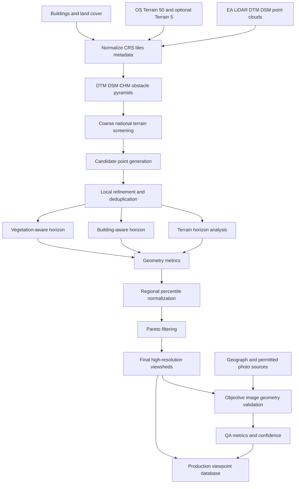
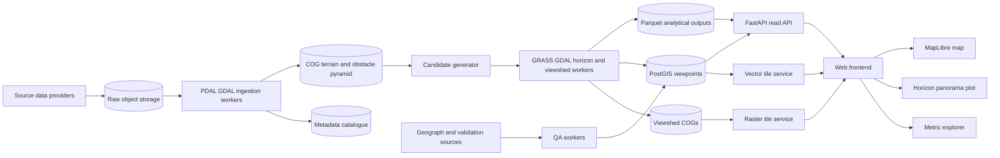

# Objective Scenic Viewpoint Detection in England: Metrics, Data, Validation, and System Architecture

## Executive summary

A website can identify places with objectively strong visual potential, but it cannot objectively prove that a view is "beautiful." Beauty is a human judgment. What can be measured reproducibly is the geometry and content of the visual field: how much terrain is visible, how far sightlines extend, how enclosed the skyline is, how much relief is exposed, how continuous the panorama is, how much vegetation and development obstruct it, and how varied the visible landscape is. The recommended product terminology is therefore **"view potential"**, with the raw metrics exposed to users rather than presenting one opaque "beauty score."

For England, the strongest open-data foundation is the Environment Agency's LiDAR estate. The National LIDAR Programme was designed to provide 1 m coverage across England, with survey products meeting approximately +/-15 cm vertical RMSE requirements; timestamped products can also exist at 25 cm, 50 cm, 1 m, and 2 m. The Environment Agency's current composite DTM and DSM cover roughly 99% of England. citeturn0search1turn0search7turn0search17 This is dramatically more appropriate for detecting actual viewpoints than global 30 m DEMs.

The recommended elevation hierarchy is:

| Purpose | Preferred source |
|---|---|
| National candidate screening | Resampled EA DTM, or OS Terrain 50 |
| Final terrain geometry | EA 1 m DTM |
| Trees/buildings and actual obstruction | EA DSM plus DTM-derived object heights |
| Higher detail in selected areas | Timestamped EA 25 cm/50 cm/1 m LiDAR |
| Medium-resolution commercial alternative | OS Terrain 5 |
| Global/fallback screening | Copernicus DEM GLO-30 |
| Precise current buildings, if licensed | OS Building Features |
| Semantic landscape composition | UKCEH LCM2024 if licensing works, otherwise open OS/EA layers |

OS Terrain 50 is open, has 50 m posts, is verified at 4 m RMSE, and is updated annually. citeturn17search0turn18search0turn23search0 OS Terrain 5 has 5 m posts and is updated quarterly, but it is a premium dataset; OS documentation gives RMSE values of about 1.5 m for urban/major communication areas and 2.5 m for rural and mountain/moorland areas. A six-month Data Exploration Licence can be used for development, but not treated as the production licensing solution. citeturn18search1turn18search8turn23search1

The core computational model should distinguish at least three surfaces:

\[
S_T = \text{bare-earth terrain}
\]

\[
S_B = \text{terrain + buildings}
\]

\[
S_L = \text{terrain + buildings + leaf-on vegetation}
\]

This allows the system to say not merely that a location has a large theoretical view, but that, for example, "81% of its terrain-only view remains after buildings but only 49% remains after vegetation." That distinction is critical for England, because woodland, hedges, and nearby development can make a geometrically excellent ridge a poor real-world viewpoint.

The most important metrics should be stored independently: visible area by distance band, horizon distance distribution, sky-view factor, panorama continuity, local relief, terrain-position index, skyline angular roughness, semantic panorama entropy, visible-water/coastline exposure, and obstruction-retention ratios. A single composite ranking should be optional. For the default discovery experience, I recommend **regional percentile normalization plus Pareto filtering**, so places such as Coombe Hill can rank exceptionally within the Chilterns without being automatically suppressed by the Lake District or Pennines.

For computation, **GRASS `r.viewshed` and GDAL viewshed should be the principal raster engines**, with SAGA useful for sky-view factor and topographic openness. HORAYZON is particularly relevant for high-performance horizon calculations. PyVista is valuable for detailed mesh/ray-tracing experiments, while PDAL belongs upstream in the LiDAR-processing pipeline. Google Earth Engine is useful for coarse terrain derivatives and experimentation, but its documented terrain API provides slope/aspect/hillshade rather than a native viewshed workflow. `pysheds` is a hydrology library, despite its name, and should not be selected as the core viewshed engine. citeturn7search0turn17search5turn8search11turn13search26turn7search3turn10search0turn10search3turn10search2

The best automated photographic validation source is **Geograph Britain and Ireland**. As of August 23, 2026, it reports more than 8.35 million images across 283,614 grid squares, has APIs and bulk database dumps, supports camera-location and view-direction metadata, and explicitly supports panoramas/photospheres. citeturn22search15turn20search2turn22search4turn22search2 Instead of using human ratings, the system can compare the predicted skyline against the photograph's measured sky/terrain boundary, compare predicted versus observed visible semantic classes, and measure angular errors in obstruction placement.

Google Street View should **not** be turned into a bulk automated validation corpus. Google's current Maps Platform terms prohibit bulk downloading and storing Street View imagery and prohibit using Google Maps Content to train, test, validate, or fine-tune machine-learning models. Street View metadata can identify available panoramas without consuming image quota, and Street View itself remains useful for compliant interactive/manual spot checking. citeturn20search3turn20search4

Finally, I found **no current "OS OpenData panoramas" product** in Ordnance Survey's OpenData catalogue. That should not be an architectural dependency. OS does provide mapping datasets and premium aerial imagery, but its MasterMap Imagery product is orthorectified aerial photography rather than a ground-level panorama corpus. This conclusion is based on the current OS OpenData catalogue, so it should be treated as a catalogue finding rather than a claim that OS has never offered any panorama-related service. citeturn23search11turn0search8

## Quantitative model of view potential

### Visibility geometry

Let an observer be located at projected coordinates \(p=(x_0,y_0)\), with bare-earth elevation \(z_0\) and eye height \(h_e\):

\[
z_{\text{obs}} = z_0 + h_e
\]

For a target surface point at horizontal distance \(r\) and azimuth \(\theta\), let its obstruction-surface elevation be \(z(r,\theta)\).

For long lines of sight, Earth curvature is no longer negligible. GDAL implements curvature/refraction by lowering the effective target elevation according to distance. Its correction can be written as:

\[
z_c(r,\theta)
=
z(r,\theta)
-
C\frac{r^2}{2R}
\]

where \(R\) is Earth radius and \(C\) is the curvature coefficient. GDAL's default coefficient has been 0.85714 for Earth since GDAL 3.4, corresponding to the conventional \(1 - 1/7\) atmospheric-refraction treatment. A coefficient of 1 models curvature without that refraction adjustment. citeturn7search0turn7search7

The apparent elevation angle is:

\[
\alpha(r,\theta)
=
\tan^{-1}
\left(
\frac{z_c(r,\theta)-z_{\text{obs}}}{r}
\right)
\]

For an azimuthal sweep, a point is visible when:

\[
\alpha(r,\theta)
\ge
\max_{0<r'<r}\alpha(r',\theta)-\epsilon
\]

where \(\epsilon\) is a very small numerical tolerance.

This gives the basic binary viewshed:

\[
V_i \in \{0,1\}
\]

for each raster cell \(i\).

The curvature term is important in England even though elevations are modest. Using GDAL's 0.85714 coefficient, curvature lowers the effective elevation of a point approximately 108 m at 40 km, 168 m at 50 km, and 430 m at 80 km relative to a straight planar treatment. Those figures follow directly from the formula above. Long-range viewpoint calculations should therefore not use a flat-Earth viewshed.

### Visible area

In British National Grid or another metric projected CRS, the simplest interpretable metric is:

\[
A_{\text{vis}}
=
\sum_i V_i A_i
\]

where \(A_i\) is raster-cell ground area.

Do not rely exclusively on total area, because a large amount of distant low-detail terrain can overwhelm nearer landscape structure. Instead compute area in fixed distance bands:

\[
A_b
=
\sum_i V_i A_i
\,\mathbf{1}(r_i\in b)
\]

A useful English-landscape convention is:

- near: 0-2 km
- middle: 2-10 km
- far: 10-30 km
- very far: 30-50 km
- extended: 50-80 km

These are proposed engineering bands, not empirical definitions of scenic quality.

Also store:

\[
f_{\text{vis},R}
=
\frac{A_{\text{visible within }R}}
{A_{\text{land within }R}}
\]

which helps distinguish "a large absolute view because the radius was large" from genuinely high exposure.

### Horizon geometry

For every azimuth:

\[
H(\theta)
=
\max_r \alpha(r,\theta)
\]

is the skyline elevation angle.

The distance of the terrain feature forming that skyline is:

\[
D_{\text{sky}}(\theta)
=
\operatorname*{argmax}_r \alpha(r,\theta)
\]

Separately calculate the **farthest visible terrain distance**:

\[
D_{\text{far}}(\theta)
=
\max\{r: V(r,\theta)=1\}
\]

The distinction matters. A mountain 5 km away might form the skyline while visible terrain extending through a valley occurs much farther away in another vertical part of the image.

Recommended derived horizon metrics are median \(D_{\text{far}}\), 90th percentile \(D_{\text{far}}\), maximum \(D_{\text{far}}\), and directional exceedance:

\[
F_R
=
\frac{1}{N_\theta}
\sum_j
\mathbf{1}\left(D_{\text{far}}(\theta_j)>R\right)
\]

For example, \(F_{10\,km}=0.7\) means 70% of sampled bearings retain visibility beyond 10 km.

### Panorama continuity

An excellent viewpoint usually differs geometrically from a narrow window between trees.

Define:

\[
P_R = F_R
\]

as the fraction of azimuths whose sightline survives beyond distance \(R\).

Also calculate the longest continuous panorama:

\[
L_R
=
\Delta\theta
\max(\text{contiguous run of }D_{\text{far}}\ge R)
\]

in degrees.

A viewpoint with \(P_{10}=0.65\) and \(L_{10}=190^\circ\) has a fundamentally different geometry from one with the same total visible area confined to disconnected 20-degree corridors.

### Sky-view factor and skyline openness

For horizontal observation, let:

\[
\gamma(\theta)
=
\operatorname{clamp}(H(\theta),0,\pi/2)
\]

Then a useful sky-view factor approximation is:

\[
SVF
=
\frac{1}{N}
\sum_j \cos^2\gamma(\theta_j)
\]

An unobstructed horizontal skyline tends toward 1; a strongly enclosed position tends toward 0.

SAGA GIS provides dedicated Sky View Factor and Topographic Openness tools, making these useful independent cross-checks against a custom implementation. Its topographic-openness tools are explicitly intended to characterize topographic dominance/enclosure, while its visibility module performs point visibility analysis. citeturn8search11turn8search14turn13search7

A simpler visual-openness statistic is:

\[
O_H
=
1-
\frac{2}{\pi}
\operatorname{mean}(\gamma)
\]

Store both rather than assuming they are interchangeable.

### Relief, ridgeline position, slope, and aspect

For a DTM \(z(x,y)\):

\[
\text{slope}
=
\tan^{-1}
\sqrt{
\left(\frac{\partial z}{\partial x}\right)^2
+
\left(\frac{\partial z}{\partial y}\right)^2
}
\]

Aspect is derived from the direction of the horizontal gradient and converted to the desired compass convention.

Raw altitude is a weak viewpoint metric. A better measure is **relative elevation**.

Local relief at radius \(R\):

\[
LR_R
=
\max_{\|p-p_0\|\le R}z(p)
-
\min_{\|p-p_0\|\le R}z(p)
\]

Terrain-position index:

\[
TPI_R
=
z(p_0)
-
\operatorname{mean}_{p\in A_R}z(p)
\]

where \(A_R\) is a radius or annulus.

Compute both at multiple scales, for example 500 m, 2 km, and 10 km. A positive 500 m TPI identifies local shoulders/ridges; the 10 km measure captures larger regional dominance.

Other useful shape metrics include:

\[
|\nabla z|
\]

for gradient magnitude,

\[
\nabla^2 z
\]

for local convexity/concavity, and percentile-based relief such as:

\[
z_0-P_{25}(z_R)
\]

which is more resistant to isolated terrain outliers than maximum-minus-minimum.

No one metric should require the observer to be on an actual summit. Coombe Hill-like viewpoints on escarpments and shoulders can have excellent visibility without being the maximum elevation inside a large neighborhood.

### Skyline roughness and angular relief

A panorama across rolling hills differs objectively from a flat horizon.

For sampled horizon elevations \(H_j\), define total angular variation:

\[
TV_H
=
\frac{1}{N}
\sum_j
|H_{j+1}-H_j|
\]

and horizon elevation spread:

\[
R_H
=
P_{95}(H)-P_5(H)
\]

Because \(TV_H\) is highly resolution-sensitive, the skyline should first be smoothed to a fixed angular scale, such as 0.25 or 0.5 degrees, and the smoothing scale should be stored with the metric.

High roughness is not synonymous with beauty. It merely expresses geometric complexity.

### Visual solid angle and terrain presentation

Counting ground hectares alone does not correspond closely to what fills a photograph. A steep hillside facing the observer can occupy much more visual field than a large nearly horizontal surface.

For a small terrain element with physical area \(A_i\), surface normal \(n_i\), viewing direction \(u_i\), and range \(d_i\), its approximate projected solid angle is:

\[
\Omega_i
\approx
\frac{
A_i
|n_i\cdot u_i|
}{
d_i^2
}
\]

This provides a principled way to weight visible terrain by how much of the actual panorama it occupies.

A better production implementation is to render the scene into a spherical categorical panorama at fixed angular resolution and count angular pixels. That automatically gives every pixel approximately equal solid-angle weight.

### Panorama diversity

Let each visible spherical panorama pixel be classified into categories such as:

- woodland
- grass/heath
- cropland
- water
- urban/built
- bare ground
- cliff/rock, where available

If \(p_c\) is the fraction of non-sky visual solid angle occupied by class \(c\), normalized Shannon entropy is:

\[
H_{\text{sem}}
=
-\frac{\sum_c p_c\ln p_c}
{\ln K}
\]

where \(K\) is the number of possible classes.

\(H_{\text{sem}}=0\) means essentially one category dominates; values approaching 1 indicate a more even semantic mixture.

This is objective **visual diversity**, not an aesthetic rating.

Distance diversity is also valuable. Calculate the same class proportions separately for 0-2 km, 2-10 km, and 10-50 km. A viewpoint containing nearby woodland, mid-distance farmland, and distant uplands will then be differentiated from an equally heterogeneous scene confined entirely to the foreground.

### Aspect and landform diversity

For each visible terrain element with aspect \(\phi_i\) and visual weight \(w_i\), compute the circular resultant:

\[
R_\phi
=
\frac{
\left|
\sum_i
w_i e^{j\phi_i}
\right|
}{
\sum_i w_i
}
\]

Then:

\[
D_\phi=1-R_\phi
\]

gives a compact measure of how many differently oriented landforms face the observer.

This can help identify bowl-shaped, valley, ridge, and escarpment panoramas without attaching a subjective quality judgment.

### Water and coastline exposure

For coastal and lake viewpoints calculate at least:

\[
F_{\text{water}}
=
\frac{\Omega_{\text{water}}}
{\Omega_{\text{non-sky}}}
\]

and

\[
F_{\text{water-bearing}}
=
\frac{1}{N}
\sum_\theta
\mathbf{1}(\text{visible water on bearing }\theta)
\]

Also calculate visible coastline length:

\[
L_{\text{coast-vis}}
=
\sum_s L_s V_s
\]

and its solid-angle or distance-weighted counterpart.

OS Terrain 50 contains coastline, lakes, breaklines, ridges, and related terrain features, making it suitable for coarse open-data water/coast geometry. citeturn17search0

### Fractal coastline and skyline complexity

Fractal metrics should be included only as secondary descriptors because they are exceptionally sensitive to spatial resolution and scale range.

For the subset of coastline actually visible from a candidate point, perform box counting. At box size \(\epsilon\), let \(N(\epsilon)\) be the number of boxes intersecting the visible coastline:

\[
D_B
=
-\frac{
d\log N(\epsilon)
}{
d\log\epsilon
}
\]

Estimate the slope using multiple scales, for example 50, 100, 200, 400, 800, and 1,600 m where the source data supports those scales.

Always store:

- the fitted dimension \(D_B\)
- minimum and maximum scale
- regression \(R^2\)
- number of visible coastline segments

A "fractal dimension of 1.3" without those parameters is nearly meaningless.

The same box-counting or multiscale roughness procedure can be applied to the angular skyline \(H(\theta)\). Again, it measures geometric complexity, not aesthetic merit.

### Obstruction resilience

This is one of the most important families of metrics for England.

Run the analysis against multiple surfaces.

Terrain only:

\[
A_T = A_{\text{vis}}(S_T)
\]

Buildings:

\[
A_B = A_{\text{vis}}(S_B)
\]

Leaf-on vegetation and buildings:

\[
A_L = A_{\text{vis}}(S_L)
\]

Then:

\[
R_B=\frac{A_B}{A_T}
\]

\[
R_L=\frac{A_L}{A_T}
\]

A theoretical ridge viewpoint with \(R_L=0.2\) is probably heavily screened by nearby trees. One with \(R_L=0.9\) is robustly open.

At skyline level:

\[
\Delta H_{\text{building}}(\theta)
=
\max(0,H_B-H_T)
\]

\[
\Delta H_{\text{vegetation}}(\theta)
=
\max(0,H_L-H_B)
\]

and an angular blockage fraction can be defined as:

\[
B_{\delta}
=
\frac{1}{N}
\sum_j
\mathbf{1}(\Delta H_j>\delta)
\]

with \(\delta\), for example, set to 0.5 or 1 degree.

These quantities answer much more useful questions than a bare DEM viewshed.

### Ranking without pretending to measure beauty

The raw vector might be:

\[
M=
[
A_{\text{vis}},
P_{10},
P_{30},
SVF,
LR_{10},
TPI_2,
TV_H,
H_{\text{sem}},
F_{\text{water}},
R_L
]
\]

The strongest design is to expose this vector and allow sorting by "widest panorama," "long-distance view," "most open," "most dramatic relief," "coastal," and similar objectively defined modes.

For automatic discovery, first convert each metric into empirical percentiles:

\[
q_j(m)=\hat F_j(m)
\]

Then calculate both **national percentile** and **local percentile**, for example relative to candidates within 25 km.

This solves an important geographic problem: without local normalization, most rankings will disproportionately favor the highest-relief areas of northern England. A Chilterns viewpoint such as Coombe Hill may be nationally moderate but locally exceptional.

A preferred default ranking is **Pareto dominance**. Candidate \(a\) dominates \(b\) when it is no worse in every selected metric and better in at least one:

\[
a\succ b
\iff
m_j(a)\ge m_j(b)\;\forall j
\quad
\land
\quad
\exists k:m_k(a)>m_k(b)
\]

Only after Pareto filtering should an optional scalar be introduced.

A transparent equal-weight "view potential" index could be:

\[
S
=
\frac{1}{5}
(
Q_{\text{extent}}
+
Q_{\text{openness}}
+
Q_{\text{relief}}
+
Q_{\text{diversity}}
+
Q_{\text{obstruction}}
)
\]

where each \(Q\) is itself a percentile-normalized bundle.

The site should label this explicitly as a ranking convention, not a scientifically measured amount of beauty.

## England data inventory

### Core elevation and obstruction datasets

| Dataset | Role | Resolution | Accuracy / quality | Currency | Access and licensing | Recommendation |
|---|---|---:|---|---|---|---|
| **Environment Agency National LIDAR Programme** | Primary high-resolution elevation source | National programme designed around 1 m coverage; denser survey products also exist | EA metadata specifies approximately +/-15 cm RMSE; nominal point density is at least 1 point/m² for a 1 m DSM, 4 points/m² for 50 cm, and 16 points/m² for 25 cm. citeturn0search7turn17search16 | Phase 1 blocks were captured over successive winters from 2017 to February 2023, so acquisition date varies spatially. citeturn0search1 | Environment Agency open data under OGL. citeturn0search7 | **Best primary source** |
| **EA LIDAR Composite DTM** | Bare-earth terrain | 1 m | Built from EA LiDAR surveys; source surveys are in the roughly +/-15 cm RMSE quality class. citeturn1search17turn0search7 | Current catalogue product is a composite produced in 2022 from the best/newest available constituent surveys, with roughly 99% England coverage. citeturn1search17 | OGL | **Use for terrain surface** |
| **EA LIDAR Composite DSM / First Return DSM** | Buildings, canopy, other surface objects | 1 m composite DSM; first-return product also available at 2 m | First-return DSM explicitly includes buildings, vegetation, vehicles, and terrain. citeturn17search14 | Composite products cover roughly 99% of England; acquisition dates within the mosaic vary. citeturn0search5turn17search14 | OGL | **Use for obstruction modeling** |
| **EA timestamped LiDAR DSM/DTM** | High-detail and temporally matched modeling | 25 cm, 50 cm, 1 m, and 2 m depending on survey availability | Approximately +/-15 cm RMSE specification. citeturn0search17 | Survey-specific timestamps rather than one England-wide epoch | OGL | **Best for final QA and high-value locations** |
| **EA Vegetation Object Model** | Vegetation/object identification derived from LiDAR | Derived from 1 m elevation data | Object-model accuracy depends on LiDAR and extraction procedure rather than having a simple standalone vertical RMSE. citeturn18search2 | EA catalogue has continued to publish/update the VOM dataset; catalogue metadata was updated in 2025. citeturn2search8 | OGL | Useful supplementary vegetation layer |
| **Derived canopy-height model** | Tree/hedge heights | Match timestamped DSM/DTM, ideally 1 m or better | Error depends on both surfaces and acquisition alignment | Recompute whenever LiDAR source changes | Derived from open EA source | **Make this yourself** |
| **OS Terrain 5** | Medium-resolution national DTM | 5 m posts; 5 m contour interval | OS documentation gives around 1.5 m RMSE for urban/major communications and 2.5 m for rural and mountain/moorland contexts. citeturn18search8 | Updated every 3 months. citeturn18search1 | Premium. Free sample and six-month Data Exploration Licence for development. citeturn23search1 | Excellent intermediate-scale source if commercially licensed |
| **OS Terrain 50** | Coarse screening and terrain context | 50 m posts; 10 m contours | Grid verified to 4 m RMSE. citeturn18search0 | Annual. citeturn17search0 | Free OS OpenData under OGL. citeturn23search0 | **Excellent MVP screening layer** |
| **Copernicus DEM GLO-30** | International/fallback coarse surface | 30 m | Absolute vertical accuracy <4 m LE90; relative <2 m on slopes <=20% and <4 m above 20%; horizontal <6 m CE90. citeturn19search0 | Distributed as a static DEM collection; Copernicus has issued corrective/format releases rather than routine topographic refreshes. citeturn19search0turn19search1 | GLO-30 and GLO-90 have free public licensing with specified attribution. citeturn19search0 | Fallback only in England |
| **UKCEH Land Cover Map 2024** | Semantic land-cover composition | 10 m classified pixels | 21 broad habitat classes; raster includes most-likely class and per-pixel probability and is validated against the parcel framework. citeturn19search2 | Represents 2024 land surface; published 2025. Recent LCM editions form an annual series, but this should not be treated as a contractual update SLA. citeturn19search2turn19search13 | **Not equivalent to OGL.** Specific licensing conditions apply to the high-resolution raster, and commercial/derived-service use needs licensing review. citeturn5view0turn19search2 | Technically excellent, but resolve licensing before basing a commercial product on it |
| **OS OpenMap Local** | Generalized building, woodland, settlement, road, and contextual masks | 1:10,000 mapping rather than an elevation raster | Generalized mapping, not obstruction-grade height data | Every 6 months. citeturn23search2 | OS OpenData, hence OGL. citeturn23search11 | Good open fallback masks |
| **OS Building Features** | Current building footprint/height/context data | Detailed vector features | Dataset includes building-related physical attributes, including heights within the NGD building collection. citeturn23search3turn23search15 | Updated daily. citeturn23search15 | Premium OS data; sample/DEL available but production requires appropriate licence | **Best licensed building layer** |

### Canopy height model

For timestamp-aligned datasets:

\[
CHM(x,y)
=
\max
\left[
0,\;
DSM_{\text{first}}(x,y)-DTM(x,y)
\right]
\]

Do not blindly subtract unrelated composite surfaces where acquisition times differ. A newly constructed building, tree removal, or changed LiDAR survey can generate false "height" differences.

A practical vegetation mask is:

\[
I_{\text{veg}}
=
(CHM>h_{\min})
\land
(\neg I_{\text{building}})
\land
I_{\text{vegetation-context}}
\]

where \(h_{\min}\) is initially around 1.5-2 m and is varied in sensitivity testing.

The Environment Agency's national surveys were acquired over winters, which is advantageous for bare-earth penetration but means deciduous-canopy representation can differ materially from summer leaf-on conditions. citeturn0search1 Therefore calculate both a "LiDAR observed" surface and a conservative leaf-on scenario.

### Building height without premium OS data

Where exact OS building heights are unavailable:

1. Obtain a generalized building polygon mask from open mapping.
2. Intersect the polygon with \(DSM-DTM\).
3. Calculate a robust roof height such as the 90th or 95th percentile rather than the maximum.
4. Remove implausible isolated spikes.
5. Reconstruct a building obstruction surface:

\[
S_{\text{building}}
=
DTM+h_{\text{building}}
\]

The robust percentile helps suppress chimneys, aerials, LiDAR artifacts, and temporary objects. This is particularly important because EA first-return DSMs can explicitly contain vehicles and other above-ground objects. citeturn17search14

With OS Building Features licensed, use authoritative building geometry/height attributes instead and use LiDAR mainly to check consistency and capture other structures. OS Building Features is refreshed daily, so it can also compensate for old LiDAR in rapidly changing urban areas. citeturn23search15

### Land-cover licensing strategy

For a commercial MVP, do **not** make the 10 m UKCEH raster an irreplaceable core dependency until commercial licensing is resolved. UKCEH's high-resolution raster is subject to its own conditions, while the UK land-cover statistics product is OGL but only contains aggregated statistics and cannot replace the 10 m map spatially. citeturn19search2turn19search8

An open-first stack can instead use:

- EA LiDAR/VOM for vegetation structure
- OS OpenMap Local for generalized woodland/building context
- OS Terrain 50 coastline/lakes
- LiDAR-derived DSM-minus-DTM object height

OS OpenMap Local is free, updated six-monthly, and specifically intended as detailed generalized mapping at 1:10,000. citeturn23search2turn23search11

That is adequate for the core **geometry** product. UKCEH primarily improves semantic-diversity metrics.

### Data freshness needs to be per tile

A single field saying "LiDAR 2026" would be misleading. EA national products are mosaics assembled from surveys acquired at different times. citeturn1search17turn17search14

Every internal terrain tile should therefore have metadata similar to:

```text
source_product
source_survey_id
acquisition_date
processing_date
horizontal_crs
vertical_reference
nominal_resolution
accuracy_class
licence
source_version
checksum
```

Every calculated viewpoint should retain the IDs/checksums of the terrain and obstruction tiles used to produce it.

This is essential for selective recomputation.

### Resolution hierarchy

Do not compute every metric on the finest data merely because 1 m LiDAR exists.

A sensible hierarchy is:

| Distance from observer | Recommended elevation representation | Purpose |
|---:|---:|---|
| 0-2 km | 1 m DTM/DSM | Trees, hedges, nearby buildings, cliffs |
| 2-10 km | 5 m | Intermediate landform and large obstacles |
| 10-30 km | 10-25 m | Large-scale terrain |
| 30-50 km | 25-50 m | Horizon-scale terrain |
| 50-80 km | 50 m | Extended long-range horizon only |

This is a proposed computational design rather than a limitation of the source datasets.

The near field deserves the finest data because a 15 m tree 50 m away can block a huge angular sector. Individual 15 m trees 40 km away are generally below the meaningful angular/spatial resolution of the panoramic analysis.

## Visibility surfaces, obstruction masking, and scalable computation

### Surface construction

Build a surface stack rather than one DEM.

Bare terrain:

\[
S_T=DTM
\]

Buildings only:

\[
S_B
=
\max
[
DTM,\;
DTM+h_bI_b
]
\]

Vegetation and buildings:

\[
S_L
=
\max
[
S_B,\;
DTM+h_vI_v
]
\]

Observed DSM:

\[
S_D=DSM
\]

These surfaces answer different questions.

`S_T` asks: "What is the site's underlying landform potential?"

`S_B` asks: "What survives permanent built obstruction?"

`S_L` asks: "What might a standing observer actually see under a leaf-on/conservative vegetation model?"

`S_D` asks: "What did the LiDAR sensor actually encounter on the survey date?"

The discrepancies between these are themselves valuable website attributes.

### Removing classes instead of only adding them

Because a DSM already contains many object types, another method is class-specific replacement.

For vegetation-free visibility:

\[
S_{\neg veg}(x,y)
=
\begin{cases}
DTM(x,y),&I_{veg}(x,y)=1\\
DSM(x,y),&\text{otherwise}
\end{cases}
\]

Similarly, buildings can be removed from the surface by replacing building pixels with the DTM.

This gives direct counterfactual questions:

- "Would this view be excellent if the trees were not present?"
- "Is urban development the dominant obstruction?"
- "Is the underlying ridge itself visually weak?"

### Human-eye observer placement

The observer elevation must be:

\[
z_{\text{observer}}
=
DTM(p)+h_e
\]

not:

\[
DSM(p)+h_e
\]

Otherwise a candidate falling inside a tree canopy might accidentally be modeled as standing on top of the tree.

An initial eye height of **1.7 m** is reasonable for the standard scenario. The value is a model parameter, not a property of England. GRASS itself defaults to 1.75 elevation units for an observer unless changed. citeturn17search5

For actual viewing platforms or monuments, store an additional platform-height field and rerun:

\[
z_{\text{observer}}
=
DTM+h_{\text{platform}}+h_e
\]

### Seasonal vegetation

I recommend publishing separate visibility scenarios:

**Terrain potential**
- DTM only.

**Built-world**
- DTM plus buildings.

**LiDAR-observed**
- DSM from acquisition date.

**Leaf-on conservative**
- DTM plus buildings plus LiDAR/VOM vegetation, with canopy gaps conservatively closed.

**Leaf-off approximate**
- DTM plus buildings, optionally retaining evergreen/dense-hedge classes where adequate classification exists.

Calling a winter LiDAR DSM "leaf-off truth" would overstate its meaning. The EA national programme's winter acquisition improves bare-earth surveying, but woodland type, understory, hedges, and conifers still complicate the visual result. citeturn0search1

### Raster downsampling for blockers

Ordinary bilinear resampling is dangerous for obstruction analysis because it can lower narrow ridges and tree rows.

For a coarse obstruction pyramid, use a conservative statistic such as:

\[
z_{\text{coarse}}
=
P_{95}(z_{\text{fine}})
\]

or maximum pooling.

This deliberately biases slightly toward blocking a sightline during the screening stage. Finalists can then be recomputed at full resolution.

A useful system can keep two pyramids:

- mean/median terrain pyramid for terrain characterization
- P95/max obstruction pyramid for conservative line-of-sight testing

### Candidate generation before expensive viewsheds

A national 1 m brute-force viewshed from every possible point is computationally unnecessary.

Start with a 250 m candidate grid and compute inexpensive features:

\[
TPI_{0.5},\;
TPI_2,\;
TPI_{10},\;
LR_2,\;
LR_{10},\;
\text{slope},\;
\text{openness proxy}
\]

Within a moving regional window, retain points that are high percentiles in at least one or two exposure indicators rather than requiring every criterion simultaneously.

For example, an initial prescreen could retain the local top 10% for any of:

- positive multi-scale TPI
- topographic openness
- local relief
- high elevation relative to surroundings

Then apply spatial non-maximum suppression within 100-250 m.

This preserves escarpment viewpoints that would be lost by a simple "find all summits" algorithm.

Refine each retained region to a 25-50 m ground grid, and only then calculate expensive viewsheds.

### Why multi-resolution processing is required

A radius of 50 km contains:

\[
\pi(50,000)^2
\approx
7.85\times10^9
\]

one-metre cells.

That is almost 7.9 billion cells for **one observer** before storing any intermediate visibility state.

Even 5 m cells would leave roughly 314 million cells.

Consequently, 1 m data should principally answer near-obstruction questions, not be scanned to the horizon for every candidate.

A better algorithm is:

```text
For every candidate viewpoint:

    load 1 m obstruction data for 0-2 km
    load 5 m terrain/obstruction data for 2-10 km
    load 25-50 m terrain for 10-50 km
    optionally extend 50 m terrain to 80 km

    for each azimuth:
        scan outward
        apply curvature correction
        keep current maximum apparent elevation angle
        record:
            terrain horizon
            obstacle horizon
            farthest visible range
            first-visible semantic class
            visible distance bands

    calculate horizon and panorama metrics

Only for finalists:
    calculate fuller raster viewsheds and visible-landcover area
```

### Adaptive angular sampling

A fixed angular step has a spatial footprint proportional to distance:

\[
s_{\theta}
\approx
r\Delta\theta
\]

At 50 km:

- 1 degree spans about 873 m
- 0.5 degree spans about 436 m
- 0.1 degree spans about 87 m
- 0.05 degree spans about 44 m

Thus a 0.5-degree horizon is perfectly useful for fast screening but will miss narrow distant topographic features.

Recommended defaults are:

| Stage | Angular sampling |
|---|---:|
| National screening | 0.5-1 degree |
| Candidate refinement | 0.25 degree |
| Final horizon profile | 0.05-0.1 degree |
| Photo validation | Match camera/panorama pixel angular resolution where practical |

An even better implementation adaptively subdivides an azimuth where neighboring rays have materially different elevations or obstacle classes.

### England-oriented starting parameters

These should be versioned model defaults rather than presented as discovered laws of scenic quality.

| Parameter | Suggested initial value |
|---|---|
| Observer eye height | 1.7 m |
| Standard terrain range | 40-50 km |
| Extended range | 80 km |
| Curvature coefficient | 0.85714 baseline, plus 1.0 sensitivity run |
| Near obstruction resolution | 1 m to 2 km |
| Mid terrain resolution | 5 m to 10 km |
| Far terrain resolution | 25-50 m |
| Screening azimuth | 0.5 degree |
| Final horizon azimuth | 0.05-0.1 degree |
| Candidate screening grid | 250 m |
| Candidate final refinement | 25-50 m |
| Candidate deduplication radius | 100-250 m |
| Vegetation height threshold | initially 1.5-2 m, with sensitivity at 1, 2, 3 m |
| Multi-scale TPI/relief radii | 0.5, 2, and 10 km |
| Semantic distance bands | 0-2, 2-10, 10-50 km |

For a preliminary "high view potential" flag, an entirely defensible engineering starting point would be:

\[
SVF > 0.65
\]

\[
P_{10km}>0.25
\]

\[
R_L>0.5
\]

and visible area greater than the **75th regional percentile** rather than an arbitrary fixed number of square kilometres.

I would not hard-code those thresholds permanently. Use them to obtain an initial candidate population, then inspect the empirical distributions across England.

### Robustness score

For each finalist, vary:

- vegetation treatment
- curvature/refraction treatment
- DEM resolution
- reasonable observer height
- source dataset where alternatives exist

If the point remains in the top regional decile in \(k\) out of \(n\) scenarios:

\[
Q_{\text{robust}}
=
\frac{k}{n}
\]

That gives users an interpretable stability measure.

A viewpoint that scores highly only when all vegetation is removed should be distinguished from one that scores highly under every scenario.

## Toolchain and processing strategy

### Tool comparison

| Tool | Actual role | Strengths for this project | Important limitation | Recommended use |
|---|---|---|---|---|
| **GDAL viewshed** | Raster line-of-sight/viewshed | Mature C/C++ geospatial stack; observer/target heights, maximum distance, curvature/refraction coefficient; current GDAL also has expanded raster viewshed functionality. citeturn7search0turn7search4 | Full raster viewsheds become expensive for large radius/many observers | Core production viewshed engine |
| **GRASS `r.viewshed`** | High-performance raster viewshed | Designed for large rasters, supports internal/external-memory operation and explicit memory control; Earth curvature can be enabled. citeturn17search5 | One still needs orchestration for national candidate sets | **Strongest primary production candidate** |
| **GRASS cumulative viewshed add-ons** | Many-observer exposure | `r.viewshed.cva` builds cumulative analyses and exposes observer/target/max-distance/refraction parameters. citeturn17search1 | Cumulative visibility is different from finding independent candidate viewpoints | Useful for later "which landscapes are visible from many viewpoints?" analysis |
| **SAGA Visibility Analysis** | Viewshed, visibility/distance | Provides observer-based visibility outputs. citeturn8search11 | Less attractive than a lean GDAL/GRASS worker stack for millions of repeat jobs | Validation/prototyping |
| **SAGA Sky View Factor / Topographic Openness** | Horizon enclosure metrics | Direct implementation of precisely the openness family needed here. citeturn8search14turn13search7 | Adds another runtime/tool dependency | Excellent reference implementation |
| **HORAYZON** | Horizon, SVF, topographic openness | Purpose-built high-performance horizon calculations with parallelized ray tracing. citeturn13search26 | Smaller ecosystem than GDAL/GRASS | Strong candidate for final horizon-profile service/batch worker |
| **PyVista** | 3D mesh ray tracing | `ray_trace` and `multi_ray_trace` support arbitrary rays against triangular meshes. citeturn7search3turn7search6 | Raster-to-mesh conversion and mesh memory make nationwide execution expensive | Fine-scale 3D validation, buildings/cliffs, selected points |
| **PDAL** | Point-cloud processing | Designed for point-cloud manipulation; can rasterize point clouds and calculate height-above-ground against a DEM. citeturn10search0turn10search4turn10search8 | Not primarily a viewshed engine | **Core LiDAR preprocessing tool** |
| **Google Earth Engine** | Large-scale cloud raster analysis | Official terrain functions provide slope, aspect, and hillshade and can support coarse screening workflows. citeturn10search3 | No documented native viewshed operation in the cited terrain API; importing/processing England-wide 1 m LiDAR is a different operational problem | Prototyping and coarse derivatives, not core 1 m visibility |
| **pysheds** | Hydrological DEM analysis | Good Python watershed/flow-routing tooling. citeturn10search2 | **It is not a viewshed library despite the similar name** | Do not select for line-of-sight |
| **Custom NumPy/Numba/C++ horizon sweep** | Directional horizon profiles | Can avoid producing enormous binary rasters when only horizon descriptors are required | Must be carefully tested against established engines | Highly worthwhile optimization after correctness baseline |

### Recommended division of responsibilities

Use **PDAL** for raw point-cloud operations.

Use **GDAL** for reprojection, COG creation, raster pyramids, general raster I/O, and one-off/reproducibility viewsheds.

Use **GRASS `r.viewshed`** as the initial high-volume reference visibility engine.

Use **SAGA** as an independent implementation against which SVF and openness calculations are regression-tested.

Evaluate **HORAYZON** for the horizon-profile workload.

Use a custom optimized radial horizon engine only after matching GDAL/GRASS results over a large suite of test sites.

### Sample GDAL viewshed

Conceptually:

```bash
gdal_viewshed \
  -ox OBSERVER_EASTING \
  -oy OBSERVER_NORTHING \
  -oz 1.7 \
  -tz 0 \
  -md 50000 \
  -cc 0.85714 \
  surface.tif \
  viewshed.tif
```

The observer, target, maximum-distance, and curvature/refraction concepts are explicitly supported by GDAL's viewshed tooling. citeturn7search0turn7search7

Use metric projected terrain data for these calculations rather than treating latitude/longitude degrees as linear distance.

### Sample GRASS operation

Conceptually:

```bash
r.viewshed \
  input=surface \
  output=viewpoint_visibility \
  coordinates=EASTING,NORTHING \
  observer_elevation=1.7 \
  target_elevation=0 \
  max_distance=50000 \
  -c
```

GRASS documents the observer height, target height, maximum-distance behavior, memory strategies, and Earth-curvature option. citeturn17search5

### Horizon-only algorithm

When a full raster is unnecessary:

```text
for theta in azimuths:

    horizon_angle = -infinity
    skyline_distance = null
    farthest_visible = 0

    for sample in increasing_distance(theta):

        z = sample_surface(sample)
        z_corrected = z - C * r^2 / (2 * earth_radius)

        angle = atan2(
            z_corrected - observer_elevation,
            r
        )

        if angle >= horizon_angle - tolerance:
            visible = true
            farthest_visible = r

            if angle > horizon_angle:
                horizon_angle = angle
                skyline_distance = r
        else:
            visible = false

    save(
        theta,
        horizon_angle,
        skyline_distance,
        farthest_visible
    )
```

This reduces output from millions of cells per candidate to perhaps a few thousand directional values.

Full viewsheds can then be reserved for the shortlisted points where visible land-area and semantic-area statistics matter.

### Parallelization

Candidates are almost independent, so parallelization is straightforward, but I/O locality matters.

Do not distribute random individual viewpoints across workers. Instead:

1. spatially cluster candidates
2. calculate each cluster's required raster window
3. load that window once
4. process many observers against it
5. write compact metrics
6. discard the raster window

This avoids repeatedly fetching the same 1 m LiDAR blocks.

The EA portal itself commonly distributes LiDAR in 5 km tile-oriented downloads and documents additional arrangements for large-volume access, so a production build should ingest source data into its own tiled object-storage layout rather than repeatedly querying the catalogue. citeturn1search23

### Cloud storage format

Recommended internal representation:

```text
Raw
  LAZ/COPC LiDAR
  original GeoTIFF
  original vectors

Normalized
  COG DTM 1 m
  COG DSM 1 m
  COG CHM 1 m
  COG building surface
  COG obstacle surface
  5 m / 10 m / 25 m / 50 m pyramids

Results
  Parquet metric tables
  PostGIS viewpoint records
  compact horizon arrays
  compressed viewshed rasters for finalists
```

Cloud Optimized GeoTIFFs allow the worker to fetch the required raster windows without opening an England-sized monolith. Point-cloud processing should remain tile-based through PDAL. PDAL's documented raster writers and height-above-ground functionality fit this preprocessing stage directly. citeturn10search4turn10search8

### Precomputation rather than browser-time calculation

Do not perform a 50 km viewshed when a user opens the map.

The public API should query already-computed viewpoint records.

Expensive recomputation belongs in batch jobs triggered by:

- new LiDAR survey tiles
- new obstacle layers
- new OS building editions where licensed
- scoring-model version changes

OS Building Features is updated daily, OS Terrain 5 quarterly, OS OpenMap Local six-monthly, and OS Terrain 50 annually, illustrating why the data-provenance layer should support source-specific update schedules rather than rebuilding everything whenever any source changes. citeturn23search15turn18search1turn23search2turn17search0

## Validation without human aesthetic ratings

### What can actually be validated

Without human preference labels, you cannot validate:

> "Humans find this beautiful."

You **can** validate:

> "Our model correctly predicts what is geometrically visible from this location."

That is the appropriate scientific target.

The main validation quantities should be:

\[
E_{\text{skyline}}
=
\frac{1}{N}
\sum_j
|
H_{\text{pred}}(\theta_j)
-
H_{\text{photo}}(\theta_j)
|
\]

in degrees,

sky-mask intersection-over-union:

\[
IoU_{\text{sky}}
=
\frac{
S_{\text{pred}}\cap S_{\text{obs}}
}{
S_{\text{pred}}\cup S_{\text{obs}}
}
\]

semantic-distribution divergence, for example Jensen-Shannon divergence:

\[
JSD(P_{\text{pred}},P_{\text{obs}})
\]

and obstruction classification:

\[
\text{building / vegetation / terrain / sky / water}
\]

against image-derived first-visible classes.

No photograph likes, favorites, stars, descriptions such as "beautiful," or Flickr "interestingness" need to enter the pipeline.

### Geograph as the principal image corpus

Geograph's explicit purpose is geographically representative photography across kilometre grid squares in Britain and Ireland. As of August 23, 2026, the project reports 8,354,177 images from 14,183 contributors covering 283,614 grid squares, or 85.4% of its target squares. citeturn22search15

For a project of this type, its practical advantages are exceptional:

- API and bulk data access are supported; for heavy requirements Geograph explicitly provides database dumps. citeturn20search2turn20search5
- Submissions can contain camera location, subject location, date, and view direction. citeturn22search4turn22search21
- Geograph has specific guidance for panoramas and 360-degree photospheres. citeturn22search2
- Geograph actively supports reuse and Creative Commons-licensed imagery. citeturn22search9

A production validation procedure is:

```text
Candidate viewpoint
        |
        v
Find Geograph photographs within 25-100 m
        |
        v
Filter for adequate camera-position precision
        |
        v
Read view direction when present
        |
        v
Estimate/obtain camera horizontal and vertical FOV
        |
        v
Render predicted terrain/obstacle horizon
        |
        +--> compare skyline elevation angle
        +--> compare sky-mask IoU
        +--> compare semantic first-hit classes
        +--> compare visible water fraction
        +--> compare vegetation/building obstruction
```

The most useful images are panoramas, wide-angle landscapes, and ordinary photos with precise camera coordinates and bearing.

### Image-derived horizon validation

Segment a photograph into:

```text
sky
terrain
vegetation
building
water
other
```

The lowest sky pixel at each horizontal image coordinate gives an observed skyline.

Given camera heading \(\psi\), horizontal FOV \(F\), and image width \(W\):

\[
\theta(x)
=
\psi+
F\left(\frac{x}{W}-\frac12\right)
\]

With camera pitch and vertical FOV, the vertical pixel coordinate can similarly be transformed to elevation angle.

Then compare:

\[
H_{\text{image}}(\theta)
\]

against:

\[
H_{\text{model}}(\theta)
\]

This directly tests whether the DTM/DSM pipeline reconstructed the real visual field correctly.

No opinion about the image's aesthetics is involved.

### Semantic panorama validation

If the model predicts that the visible visual field is:

```text
41% grass/cropland
27% woodland
18% sky-excluded distant upland
9% water
5% buildings
```

the corresponding segmented photograph provides an independent observed distribution.

Calculate Jensen-Shannon divergence or another symmetric bounded distribution distance.

Repeated mismatches can reveal systematic problems:

- canopy model too tall
- building footprints too generalized
- obsolete LiDAR
- land-cover classification problem
- incorrect camera bearing
- too-coarse distant DEM
- insufficient Earth-curvature treatment

### Geograph coverage as a secondary proxy

The number of photographs near a candidate can be retained as:

\[
N_{\text{photos},100m}
\]

and the number of distinct photographers:

\[
N_{\text{photographers},100m}
\]

These are objective observations, but they should **not** become ground truth for scenery.

They are confounded by roads, tourism, population density, accessibility, contributor geography, and historic site popularity.

Use them as "photographic coverage" or "validation confidence," not "beauty."

### Google Street View

Google's Street View Static API can return a view using location, heading, pitch, and FOV parameters, and requires an API key/billing for imagery requests. citeturn20search0turn20search6

The metadata service is particularly useful because it can report panorama availability, position, acquisition date, panorama ID, and copyright data without consuming image quota. citeturn20search3

However, the June 23, 2026 Google Maps Platform terms expressly prohibit bulk downloading Street View imagery, broad caching/rehosting, creation of derived content in specified cases, and using Google Maps Content to train, test, validate, or fine-tune machine-learning/AI models. citeturn20search4

Therefore:

| Proposed use | Recommendation |
|---|---|
| Determine whether Street View exists near candidate | Good |
| Display compliant Street View to a user | Good |
| Manual engineering spot check | Potentially useful within applicable terms |
| Bulk-download England Street View | **Do not do** |
| Train panorama segmentation from Street View | **Do not do** |
| Automated ML validation corpus | **Do not do under the cited terms** |
| Persist extracted horizon features derived from imagery | Obtain legal guidance rather than assuming this is permitted |

This makes Geograph substantially more suitable for the automated QA pipeline.

### Flickr

Flickr's official photo-search API supports bounding-box/radius searches, geotag filters, acquisition-date filtering, license filtering, and location accuracy values. Geo searches can therefore produce another independent set of ground-level landscape photos. citeturn21search0

But Flickr's API terms emphasize that copyright remains with individual photo owners. Commercial use must respect the particular image's licence, commercial API access rules, removal/privacy changes, and limits on image caching. citeturn21search1

Thus the safe architecture is:

```text
Flickr metadata search
        |
        v
restrict to explicitly compatible licences
        |
        v
store photo ID + metadata + licence
        |
        v
process imagery only under terms allowing the intended use
        |
        v
remove/update when required by source status
```

Flickr maintains substantial Creative Commons collections, but the exact licence is image-specific. citeturn21search2

Geograph remains the cleaner primary corpus for England.

### OS imagery and the "OS OpenData panoramas" issue

As of the present OS catalogue, I found no ground-level "OS OpenData panoramas" dataset in the OS OpenData portfolio. OS describes its OpenData catalogue as free geospatial mapping, boundary, location, terrain, and related products under the OGL. citeturn23search11

OS MasterMap Imagery is instead orthorectified aerial photography, at up to approximately 25 cm resolution and with quarterly updating according to the current product information. It is premium rather than an open ground-level panorama dataset. citeturn0search8

Aerial imagery is nevertheless useful to validate:

- recent woodland clearing
- canopy extent
- new construction
- building footprints
- surface-water geometry
- LiDAR temporal staleness

It does not directly validate the ground-level skyline.

### Elevation ground truth

The Environment Agency also publishes LiDAR ground-truth information based on independent GPS check points. Its documentation describes independent ground points at roughly +/-3 cm RMSE and LiDAR acceptance requirements around +/-15 cm RMSE with limits on random error. citeturn1search19

Use these data to validate elevation-model accuracy independently of the photographic tests.

The complete QA stack therefore has two layers:

**Geometry QA**
- EA ground-control/check points
- cross-comparison of DTM sources
- high-resolution timestamped LiDAR

**Visibility QA**
- Geograph horizon profiles
- open/licensed Flickr imagery
- manual compliant Street View checks
- aerial imagery for obstruction currency

### Resolution sensitivity testing

For a representative set of sites, calculate identical metrics from:

- EA 1 m DTM
- resampled EA 5 m
- OS Terrain 5 where licensed
- OS Terrain 50
- Copernicus GLO-30

Then calculate:

\[
\Delta SVF
\]

\[
\Delta A_{\text{vis}}
\]

\[
MAE(D_{\text{horizon}})
\]

and rank correlation.

This establishes which metrics can safely be calculated cheaply.

Copernicus GLO-30 has <4 m absolute LE90 accuracy but remains a 30 m surface model, whereas EA's national LiDAR is around 1 m with much tighter vertical accuracy. citeturn19search0turn0search7 It would be surprising if they produced equivalent near-obstacle viewsheds, and the sensitivity experiment quantifies exactly how different they are rather than assuming a particular error.

### A useful Coombe Hill regression test

Coombe Hill Monument can be retained as an engineering regression site without assigning it a human score.

For example:

1. Generate candidate points in a 5 km area around the monument without telling the algorithm which point is the known viewpoint.
2. Rank by local geometric metrics.
3. Test whether the monument/ridge neighborhood is on or near the local Pareto frontier.
4. Compare it against elevation-matched random points nearby.
5. Inspect terrain-only versus leaf-on obstruction retention.
6. Find suitably located Geograph imagery and compare the predicted horizon.

Passing the test does not prove "beauty." It demonstrates that a known example of an open viewpoint is represented by the expected geometric characteristics.

## Recommended end-to-end pipeline

### Processing flow



### Ingestion

Normalize England's input rasters onto a consistent projected grid.

Do not mix resolutions by naïve mosaicking.

The ingestion job should:

```text
download/import source tile
validate CRS and vertical metadata
calculate checksum
record acquisition/edition date
convert to internal COG
create overviews
calculate quality mask
register extent in catalogue
```

For raw LiDAR:

```text
point cloud
   -> PDAL classification/cleanup
   -> DTM / first-return DSM as needed
   -> height above ground
   -> vegetation/building object candidates
```

PDAL explicitly provides point-cloud processing, DEM rasterization, and height-above-ground operations suitable for this workflow. citeturn10search0turn10search4turn10search8

### Terrain derivatives

Precompute:

```text
slope
aspect
local relief 500 m
local relief 2 km
local relief 10 km
TPI 500 m
TPI 2 km
TPI 10 km
curvature
topographic openness proxy
```

Google Earth Engine's official terrain functions can calculate slope and aspect for coarse experiments, but the core production stack can calculate them directly from the locally maintained elevation pyramids. citeturn10search3

### Candidate generation

A good first implementation:

```text
England
  |
  v
250 m observation grid
  |
  v
remove water/building/canopy-invalid observer cells
  |
  v
calculate terrain-position and openness features
  |
  v
within each region:
    retain top local percentiles
  |
  v
100-250 m non-maximum suppression
  |
  v
refine each survivor on 25-50 m grid
```

Do not use a simple "elevation > X metres" threshold.

That would disproportionately find mountains and miss coastal cliffs, chalk escarpments, lowland ridges, and artificial viewing platforms.

### Fast horizon pass

For every refined candidate, run the radial horizon algorithm against terrain.

Store arrays such as:

```json
{
  "azimuth_step_deg": 0.25,
  "terrain_horizon_deg": [],
  "terrain_skyline_distance_m": [],
  "terrain_farthest_visible_m": []
}
```

Candidates failing to show meaningful exposure can be dropped before building/vegetation analysis.

### Obstruction pass

Calculate the equivalent arrays for:

```text
terrain
terrain + buildings
terrain + buildings + vegetation
observed DSM
```

From these compute:

```text
SVF
P_2km
P_10km
P_30km
longest panorama arc
building blockage fraction
vegetation blockage fraction
leaf-on retention
```

This pass is substantially more valuable than simply labeling every high point a viewpoint.

### Detailed viewshed pass

Only finalists get complete visible-area products.

Calculate:

```text
visible area by distance band
visible land-cover area
visible angular land-cover distribution
water exposure
coastline exposure
visible settlement fraction
visual solid-angle distributions
```

Persist the metric table and optionally a compressed viewshed raster.

### Semantic spherical rendering

For high-quality finalists, construct a low-resolution synthetic panoramic raster:

```text
x = azimuth
y = elevation angle

pixel values:
    sky
    terrain-landcover-class
    vegetation
    building
    water
```

This produces three benefits simultaneously:

- visualizable predicted panorama
- semantic-diversity statistics
- direct correspondence to ground photographs

It may become the single most useful intermediate product in the entire system.

### Regional normalization

Store at least:

```text
raw_value
national_percentile
regional_percentile_10km
regional_percentile_25km
regional_percentile_50km
```

This lets the frontend offer:

- "Best views in England"
- "Best views near Oxford"
- "Best views in the Chilterns"
- "Best long-distance views"
- "Most open panoramas"

without recomputing geometry.

### Access should remain separate from view quality

Whether the user can legally or safely stand at a candidate point is a separate question from whether the geometry is excellent.

The internal model should therefore separate:

```text
view potential
accessibility
land ownership/access rules
path proximity
parking/public transport
safety
```

Do not contaminate the geometric model by silently scoring a mediocre view higher merely because it is accessible.

Instead, use accessibility as a filter after view-potential calculation.

## Website architecture and concrete build plan

### Proposed architecture



### Data store

Use object storage for the large immutable geospatial assets:

```text
s3://terrain/raw/...
s3://terrain/dtm-1m/...
s3://terrain/dsm-1m/...
s3://terrain/chm-1m/...
s3://terrain/pyramids/...
s3://viewsheds/...
```

Use **PostGIS** for:

```text
candidate geometry
final viewpoint geometry
summary metrics
regional rankings
provenance/version
validation results
nearby spatial queries
```

Use Parquet for large analytical intermediate tables and bulk ranking jobs.

A compact conceptual `viewpoints` record is:

```text
id
geom
ground_elevation_m
observer_height_m

visible_area_2km
visible_area_10km
visible_area_30km
visible_area_50km

svf_terrain
svf_building
svf_leafon

horizon_median_m
horizon_p90_m
horizon_max_m
panorama_10km_fraction
longest_panorama_10km_deg

local_relief_500m
local_relief_2km
local_relief_10km
tpi_500m
tpi_2km
tpi_10km

semantic_entropy
water_angular_fraction
visible_coastline_length
skyline_roughness

building_retention
leafon_retention

national_percentiles
regional_percentiles

horizon_profile
source_manifest
algorithm_version
validation_metrics
```

### Processing backend

Recommended services:

**Ingestion worker**
- GDAL
- Rasterio
- PDAL
- GeoPandas where appropriate

**Visibility worker**
- GRASS `r.viewshed`
- GDAL viewshed
- HORAYZON evaluation
- optimized custom horizon code later

**Batch orchestration**
- any robust workflow system capable of retries, lineage, and partitioned jobs
- jobs partitioned by spatial tile/region

**API**
- Python/FastAPI is a natural fit because most analytical code will already be Python or callable geospatial binaries

**Raster serving**
- COG-aware tile server

**Vector serving**
- PostGIS-backed vector tiles or pre-generated PMTiles where data is mostly static

**Frontend**
- MapLibre GL JS
- WebGL terrain where useful
- polar horizon graph
- azimuth profile
- transparent viewshed overlays

### API design

Useful endpoints include:

```text
GET /viewpoints
GET /viewpoints/{id}
GET /viewpoints/{id}/horizon
GET /viewpoints/{id}/metrics
GET /viewpoints/{id}/validation
GET /viewpoints/{id}/nearby-comparison
GET /rankings
```

Example query:

```text
/viewpoints?
bbox=...
&min_horizon_10km_fraction=0.5
&min_leafon_retention=0.6
&sort=regional_openness
```

A response should provide not only a score but evidence:

```json
{
  "view_potential_percentile": 97.4,
  "regional_percentile": 99.1,
  "visible_area_30km_km2": 182.6,
  "svf_leafon": 0.81,
  "horizon_p90_km": 31.4,
  "panorama_beyond_10km_fraction": 0.68,
  "longest_open_arc_deg": 154.5,
  "leafon_retention": 0.76,
  "semantic_entropy": 0.63,
  "data_confidence": "high"
}
```

Those figures are illustrative schema examples, not measurements for a real site.

### Frontend presentation

A viewpoint page should show:

**Map**
- marker
- terrain-only viewshed
- leaf-on viewshed
- distance rings
- obstruction sectors

**Horizon chart**
- azimuth 0-360 degrees
- terrain horizon
- building horizon
- vegetation horizon
- horizon distance

**Objective metric card**
- visible area
- open panorama angle
- median/maximum horizon
- sky-view factor
- local relief
- semantic diversity
- water/coastal exposure
- vegetation retention

**Data confidence**
- LiDAR acquisition year
- DEM source/resolution
- photo-validation count
- skyline MAE
- source freshness

That presentation makes the rankings auditable.

### Suggested product categories

Instead of one "most beautiful" list, generate several reproducible categories:

| Category | Primary objective metrics |
|---|---|
| **Wide panorama** | SVF, long-range bearing fraction, longest open arc |
| **Long-distance view** | median/p90/max \(D_{\text{far}}\) |
| **Expansive view** | visible area by 10/30/50 km rings |
| **Dramatic terrain** | local relief, angular relief, skyline roughness |
| **Open in summer** | leaf-on retention, vegetation blockage |
| **Coastal panorama** | water solid angle, visible coast length, sea-bearing fraction |
| **Varied landscape** | semantic entropy, distance-layer diversity |
| **Hidden geometric potential** | high terrain-only metrics, low leaf-on retention |
| **Local standout** | regional percentile |
| **National standout** | England-wide percentile |

This is both more honest scientifically and much more useful to users.

### Implementation sequence

| Build stage | Work | Output |
|---|---|---|
| **Open-data prototype** | EA DTM/DSM, OS Terrain 50, basic terrain metrics, GRASS/GDAL horizon calculations | A few regions with ranked candidates |
| **England screening** | National coarse candidate grid, local-percentile candidate selection, multi-resolution horizon engine | National candidate catalogue |
| **Obstacle model** | CHM, building extraction, terrain/building/leaf-on surfaces | Realistic obstruction-aware rankings |
| **Detailed metrics** | Full viewsheds on finalists, spherical semantic panoramas, coastline/water metrics | Production metric catalogue |
| **Objective QA** | Geograph import, horizon extraction, skyline/semantic comparison | Error metrics and confidence scores |
| **Production website** | PostGIS/API/vector/raster tile services, frontend horizon visualizations | Public discovery site |
| **Premium enhancement** | OS Terrain 5, OS Building Features, potentially UKCEH LCM under suitable commercial terms | Higher semantic/current-data fidelity |

### Minimum viable data stack

The MVP can remain overwhelmingly open:

```text
Environment Agency 1 m DTM
Environment Agency DSM
Environment Agency VOM or derived CHM
OS Terrain 50
OS OpenMap Local
Geograph
```

EA LiDAR supplies the key high-resolution geometry and is openly available; OS Terrain 50 and OpenMap Local fall within OS's OGL OpenData portfolio. citeturn0search7turn17search0turn23search2turn23search11

This is sufficient to demonstrate the core idea without first committing to premium data.

### Preferred production stack

For a higher-budget commercial deployment:

```text
EA 1 m DTM/DSM
+
timestamped EA LiDAR where needed
+
OS Terrain 5
+
OS Building Features
+
licensed UKCEH LCM
+
OS aerial imagery for freshness QA
+
Geograph photographic validation
```

OS Terrain 5 and Building Features require an appropriate production licence; the six-month DEL is explicitly an exploration/development arrangement. citeturn23search1turn23search15 UKCEH's high-resolution LCM has separate licensing conditions and should similarly receive an explicit commercial-use assessment before derived services are designed around it. citeturn5view0turn19search2

### The strongest technical recommendation

The critical design decision is to **not build a giant nationwide viewshed database at 1 m resolution**.

Instead build:

\[
\text{coarse candidate discovery}
\rightarrow
\text{multiresolution horizon analysis}
\rightarrow
\text{obstruction analysis}
\rightarrow
\text{detailed viewsheds for finalists}
\]

and treat the compact directional horizon profile as a first-class data product.

For each candidate, a 1,440- or 3,600-value horizon vector is tiny compared with a 50 km binary viewshed. Yet from it the system can derive horizon height, distance, skyline complexity, angular openness, long-range continuity, building obstruction, vegetation obstruction, and a synthetic panorama.

That makes it feasible to search England systematically rather than merely calculating a beautiful-looking viewshed for already-known viewpoints.

Most importantly, the resulting website can make a precise claim:

> **These are places with exceptional measurable visual exposure, openness, distance, landform structure, and panorama diversity.**

It does not need to claim that an algorithm has objectively solved beauty. That separation between measurable geometry and subjective preference is what makes the project scientifically defensible, reproducible, and technically scalable.