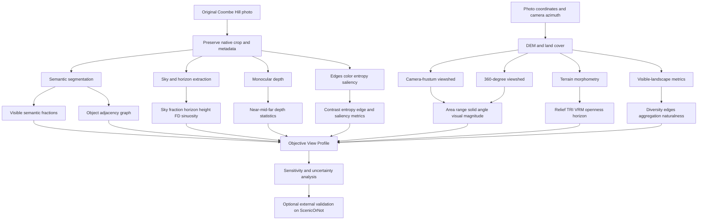

# Objective Metrics for the Aesthetic Quality of Outdoor Views and Landscapes

## Executive summary

There is no scientifically accepted "beauty meter" that measures landscape beauty as a physical property in the same sense that a thermometer measures temperature. The defensible objective literature instead consists of a large family of **measurable visual, geometric, topographic, ecological, and information-theoretic proxies** whose relationships with scenic preference can be tested against human judgments. Landscape research has formalized concepts such as visual scale, complexity, coherence, naturalness, imageability, disturbance, stewardship, historicity, and ephemera, while GIS, computer vision, geomorphometry, landscape ecology, and urban morphology provide ways to calculate subsets of those concepts without asking anyone whether a scene is beautiful. citeturn22search4turn23search2turn23search3

The strongest conclusion from this literature is that **objective scenic quality should be represented as a multidimensional profile, not a single universal scalar**. Very different landscapes can be attractive for different objective reasons: a nearly featureless seascape can have low edge density and low land-cover diversity but tremendous openness; a mountain view can have high relief, skyline complexity, depth, and edge density; an English pastoral landscape can combine moderate patch diversity, long visibility, vegetation, historical structure, and low built disturbance. Metrics that work well in one setting can therefore fail catastrophically in another. This explains why landscape-indicator research repeatedly combines several dimensions rather than reducing beauty to one physical variable. citeturn0search1turn23search3turn23search1

The objective methods with the best direct landscape-aesthetics pedigree are:

- **Visibility and visual-scale measures**: viewshed area, mean and maximum visible distance, horizon distance, isovist area, visual magnitude, solid angle, visual exposure, and enclosure. Benedikt's isovist formalism provides an objective geometry of visible space; later GIS research developed "visualscapes", route visibility, solid-angle exposure, and perceptually improved alternatives to simple binary viewsheds. citeturn26search0turn26search1turn26search10turn26search23
- **Landscape structural diversity**: edge density, patch richness, Shannon diversity, shape complexity, interspersion, contagion, and related FRAGSTATS-type metrics. These have repeatedly been proposed as quantitative components of landscape aesthetics, although high diversity can also represent ugly fragmentation and therefore does not monotonically imply beauty. citeturn0search0turn23search1turn8search4
- **Fractal and multiscale structure**: especially fractal dimension of landscape silhouettes and boundaries. Hagerhall, Purcell, and Taylor found preference related to skyline fractal dimension, with intermediate dimensions around roughly 1.3-1.5 particularly favored in their stimulus set; related work on fractal images also found preference concentrated in an intermediate range rather than increasing indefinitely with complexity. citeturn22search3turn16search0turn16search4
- **Terrain morphology**: relief, slope, curvature, ruggedness, openness, and topographic position. TRI provides a purely numerical measure of topographic heterogeneity; VRM describes dispersion of surface orientations; Yokoyama-style topographic openness describes terrain convexity and concavity. These are excellent objective measures of landform drama but weak standalone measures of beauty because beautiful landscapes can also be flat. citeturn28search8turn28search1turn28search30
- **Image structure**: sky fraction, horizon position and sinuosity, edge density, orientation entropy, luminance contrast, color statistics, symmetry, balance, depth layering, and saliency. These can all be computed from a photograph without scenic ratings. Bottom-up saliency models such as Itti-Koch-Niebur provide non-aesthetic visual-attention maps, while modern monocular-depth and semantic-segmentation models make previously difficult spatial variables measurable. citeturn20search1turn20search3turn21search1
- **Semantic and ecological composition**: proportions and configuration of vegetation, water, bare ground, agriculture, built structures, roads, and sky. Remote-sensing products such as ESA WorldCover make this computable around a viewpoint at 10 m scale, while satellite indices such as NDVI/EVI measure vegetation properties and global surface-water products measure water occurrence. These are ecological or compositional proxies, not beauty itself. citeturn28search3turn9search0turn9search13turn9search2
- **Information and complexity measures**: Shannon entropy, edge-orientation entropy, compressibility, multiscale entropy, spectral statistics, graph density, and object-connectivity measures. Recent work has explicitly represented segmented scenic photographs as object graphs, while other research uses compression as an objective estimate of visual complexity. citeturn12search0turn16search2turn16search3
- **Natural-image quality measures**: NIQE is particularly relevant because it was deliberately designed as a "completely blind" image-quality estimator without subjective opinion scores in its training objective. It is useful for controlling technical photographic quality, but it measures deviations from natural-image statistics rather than scenic beauty. citeturn20search0

The most impressive numerical scenic-prediction results in the literature generally **stop being strictly objective at the final modeling stage**, because regression coefficients or neural networks are learned from human scenicness scores. Schirpke, Tasser, and Tappeiner's mountain-landscape model, for example, reported R^2 = 0.72 and found the near zone contributing about 48 percent, but the method explicitly combined objective spatial analysis with perception-based calibration. It is therefore highly informative about useful variables, but its final score does not satisfy a strict no-human-feedback definition. citeturn22search5turn22search9 Deep models trained directly on ScenicOrNot, AVA, AADB, or similar aesthetic ratings should be excluded for the same reason. ScenicOrNot itself remains exceptionally useful as an **external validation benchmark**: it contains about 217,000 geolocated Great Britain images covering nearly 95 percent of 1 km grid squares, with approximately 1.5 million scenicness votes in the research-era snapshot. citeturn27search2turn27search12turn27search14

For **Coombe Hill**, the strongest a priori objective hypothesis is that the view's appeal is likely associated with unusually high visual scale and prospect. The National Trust describes Coombe Hill at 852 ft above sea level with extensive views across the Aylesbury Vale and, in clear conditions, toward the Cotswolds. The Chilterns National Landscape describes the western chalk scarp as a prominent, steep ridge supporting a mosaic of chalk grassland, woodland, scrub, and parkland, with extensive views from open downland. Those physical facts predict a combination of long sightlines, a large far-depth component, strong terrain-background layering, an expansive sky-horizon boundary, relatively high landscape heterogeneity, and low enclosure. citeturn19search7turn19search2turn19search14

The attached photograph itself was not retrievable through the conversation's available file store, so I do **not** make claims about its actual sky fraction, color, horizon, vegetation, monument placement, or composition. The recommended procedure below is therefore a rigorous analysis specification for that photograph rather than fabricated image measurements.

## Scope, definitions, and taxonomy

The term **objective** needs a precise operational definition because several superficially "automatic" methods contain human judgment at different stages.

I recommend three tiers:

| Tier | Definition | Included here? | Examples |
|---|---|---:|---|
| **Physical/analytic objective** | Metric is a fixed calculation from pixels, DEMs, land cover, geometry, or physical measurements. No aesthetic labels are needed to calculate or fit it. | Core | Viewshed, edge density, entropy, skyline fractal dimension, TRI, sky fraction, NDVI |
| **Learned non-aesthetic objective proxy** | A model is learned for another task such as segmentation or depth, but never trained to predict beauty, preference, or scenicness. | Core, but flagged | Semantic masks, monocular depth, learned object boundaries |
| **Preference-calibrated predictor** | Human beauty/scenicness judgments determine coefficients, model parameters, weights, thresholds, or training targets. | Discussed for validation and historical comparison, but excluded from the strict objective set | ScenicOrNot CNNs, AVA aesthetic models, regressions fitted to preference surveys |

This distinction is important. Using a scenicness survey **afterward to test** whether horizon complexity correlates with human preference does not make the horizon metric itself subjective. Using the same survey to optimize the horizon metric's coefficient in a final beauty score does. Frank et al. explicitly evaluated a landscape-metrics-based objective assessment against visual estimation, illustrating the former logic, whereas Schirpke et al. explicitly combined objective and perception-based methods in their predictive model. citeturn23search1turn22search9

Under an even stricter interpretation in which *any* human annotation in the processing stack is forbidden, semantic models trained from manually labeled segmentation datasets should also be excluded. You would then be restricted principally to raw pixel statistics, unsupervised segmentation, geometric computer vision, DEM/GIS calculations, satellite indices, and physical environmental variables. Modern learned depth estimation is somewhat intermediate because its supervision can come from sensors, stereo, structure-from-motion, synthetic worlds, and heterogeneous depth datasets rather than aesthetic preference. MiDaS, for example, was explicitly designed for robust depth transfer across multiple depth datasets rather than aesthetic assessment. citeturn20search3

There are also several assumptions implicit in the question:

1. "Beauty" is being treated as **visual scenic quality**, not historical meaning, memories, soundscape, smell, thermal comfort, cultural identity, or spiritual significance. Landscape-perception theory recognizes dimensions such as historicity and imageability that are not fully recoverable from pixels or elevation. citeturn22search0turn22search4
2. A still photograph is being used as a surrogate for an embodied view. A photograph has a crop, field of view, exposure, dynamic range, focal length, orientation, and chosen moment that can radically change objective image metrics while the physical place remains unchanged.
3. Human ratings are permitted only for **validation**, not for defining or optimizing the core objective metric.
4. "Objective" means reproducibly computable, not philosophically culture-free. Choices such as analysis radius, edge threshold, land-cover taxonomy, number of entropy bins, or equal weighting are themselves methodological decisions.
5. A metric's correlation with preference does not prove that the metric causally creates beauty. Several metrics are strongly correlated with one another.
6. No image resolution was specified, so all image-space quantities should either be normalized by image dimensions or tested across multiple resampling scales.
7. The current review treats aesthetic-prediction models trained on human labels as comparison baselines rather than qualifying answers to the core no-human-feedback requirement.

A useful taxonomy is:

```mermaid
flowchart TD
    A[Objective landscape-view measurements] --> B[Image-space]
    A --> C[Geometry and GIS]
    A --> D[Terrain and geomorphometry]
    A --> E[Remote sensing and ecology]
    A --> F[Information structure]

    B --> B1[Color and luminance]
    B --> B2[Edges and texture]
    B --> B3[Skyline and horizon]
    B --> B4[Composition and saliency]
    B --> B5[Semantic fractions]
    B --> B6[Monocular depth]

    C --> C1[Viewshed]
    C --> C2[Visual magnitude]
    C --> C3[Solid angle]
    C --> C4[Isovist and enclosure]
    C --> C5[Visibility graph]

    D --> D1[Relief and slope]
    D --> D2[TRI and VRM]
    D --> D3[Topographic openness]
    D --> D4[Curvature and horizon geometry]

    E --> E1[Vegetation indices]
    E --> E2[Water fraction]
    E --> E3[Land-cover diversity]
    E --> E4[Naturalness and fragmentation]

    F --> F1[Entropy]
    F --> F2[Fractal dimension]
    F --> F3[Compression complexity]
    F --> F4[Object adjacency graphs]
```

This taxonomy closely matches the trajectory of landscape-indicator, visibility-analysis, landscape-ecology, and computational-image research, while making explicit that many "aesthetic" variables are actually measurements of structure, complexity, openness, naturalness, or visual information. citeturn22search4turn26search1turn8search4turn12search0

## Metric families and formal methods

The table below separates **what can actually be measured** from claims about beauty. "Evidence" refers to evidence that the metric has been connected to landscape perception, not evidence that it is a universal beauty law.

| Metric family | Input | Objective quantities | Approximate computation | Landscape-aesthetic evidence | Principal failure modes |
|---|---|---|---|---|---|
| **Skyline fractal dimension** | Image | Box-counting dimension of sky-land silhouette | Low-medium, roughly O(N log S) across scales | Direct landscape study; preference varied systematically with skyline FD, with intermediate values around 1.3-1.5 favored in the cited stimulus set. citeturn22search3turn16search0 | Horizon extraction, crop, resolution, trees, haze; relation is nonlinear |
| **Whole-image or regional fractal structure** | Image | Box-count FD, multiscale texture dimension | Medium | Broader fractal-aesthetic experiments also favor intermediate complexity rather than maximal D. citeturn16search4 | Not landscape-specific; several estimators produce different D |
| **Edge density and edge complexity** | Image | Edge pixels/N; total contour length/area | Low, O(N) | Closely related to visual-complexity indicators; edge/shape measures recur in landscape analysis. citeturn23search3turn8search4 | Noise, foliage and grass can produce huge edge counts; threshold dependent |
| **Orientation entropy** | Image | \(H_\theta=-\sum p_k\log p_k\) over edge orientations | Low | Objective visual-complexity measure used in image/art structure research. citeturn16search3 | High entropy can mean richness or disorder |
| **Intensity/color entropy** | Image | Shannon entropy of luminance, hue, chroma, or local histograms | Low, O(N) | Useful complexity descriptor, but no stable universal scenic correlation | JPEG noise, shadows and exposure inflate entropy |
| **Luminance contrast** | Image | RMS contrast, percentile contrast, local contrast | Low | Physically interpretable visibility and photographic-quality proxy | Weather and camera tone mapping dominate |
| **Color structure** | Image | Mean/variance Lab chroma, hue diversity, saturation, blue/green/brown fractions, complementary hue distances | Low | ScenicOrNot research found scenic scenes were not simply "greener"; scenic images included substantial blue, brown and gray, while green could also occur in low-rated scenes. citeturn27search14 | Season, white balance, sunset, haze, camera processing |
| **Sky fraction** | Image | Sky pixels/total pixels | Low after segmentation | Direct objective proxy for openness and visual scale, conceptually related to visual-scale research. citeturn23search2 | Wide-angle lenses and crop can change it dramatically |
| **Horizon position** | Image | Median horizon y/H; vertical variance | Low | Formal composition descriptor; limited landscape-specific causal evidence | Photograph rather than place property |
| **Horizon sinuosity/roughness** | Image | Horizon length/image width; curvature; peak count; FD | Low-medium | FD has direct empirical support; other variants are plausible structural descriptors. citeturn22search3 | Trees/buildings can be mistaken for landform |
| **Bottom-up saliency** | Image | Saliency entropy, number of peaks, centroid, concentration, left-right balance | Low-medium | Itti-Koch-Niebur provides a formal non-aesthetic saliency calculation. citeturn20search1 | Attention is not preference; semantically meaningful landmarks can escape low-level saliency |
| **Photographic balance/rule geometry** | Image | Saliency distance to thirds, mass balance, symmetry, dominant-line intersections | Low | Common image-composition descriptors, but landscape-specific generalization is weak | Highly photographer-dependent |
| **Depth layering** | Image | Near/mid/far proportions, depth entropy, relative depth range, occlusion layers | High with learned depth | Depth and visual scale have long-standing links to landscape perception; modern monocular depth makes them computable from a single image. citeturn23search2turn20search3 | Monocular depth is relative and can fail on haze, sky, water and distant ridges |
| **Semantic land-cover fractions** | Image | Vegetation, water, built, road, ground, mountain, sky fractions | High with segmentation | Interpretable physical content. ScenicOrNot evidence shows natural/open composition matters but vegetation alone is insufficient. citeturn27search14turn21search1 | Segmentation domain shift; category taxonomy affects results |
| **Object variety and adjacency** | Image | Number of object classes, boundary adjacency graph, graph density, clustering | High, segmentation dominates | A 2025 scenic-image study explicitly analyzed object variety and graph connectivity against scenicness; its graph descriptors are objective, although its fitted preference models are human-calibrated. citeturn12search0turn14view0 | Graph depends strongly on segmentation and granularity |
| **Natural-image statistics/NIQE** | Image | Deviations from natural-scene-statistics model | Medium | NIQE was designed to assess image quality without subjective training scores. citeturn20search0 | Technical image quality is not aesthetic quality |
| **Compression complexity** | Image | Compressed/original byte ratio, ensemble compressibility | Low-medium | Compression has been proposed as an objective measure of aesthetic/visual complexity. citeturn16search2 | Sensitive to codec, resolution, texture and sensor noise |
| **Living-structure "structural beauty"** | Image | Automatically extracted substructures and hierarchical organization | Medium-high | Jiang and de Rijke proposed an explicit computational beauty quantity based on "living structure", one of the unusual attempts at an aesthetic-like scalar not learned from ratings. citeturn15search1 | Limited independent validation; theoretical assumptions are strong |
| **Binary viewshed** | DEM/DSM + viewpoint | Visible area, visible fraction, directionality, maximum range | Medium-high; repeated viewpoints multiply cost | Core objective visibility measure; operationally supported in modern GIS. citeturn25search0 | A far-away tiny cell counts like a visually dominant near feature |
| **Visual magnitude** | DEM/DSM | Visibility weighted by slope, aspect and distance relative to observer | High | Developed specifically to make visibility analysis more human-centered. citeturn26search10turn26search2 | Requires accurate terrain/surface geometry |
| **Solid-angle exposure** | DEM/DSM | Steradians subtended by visible cells/features | High | GIS visual-exposure work uses retinal/solid-angle weighting rather than binary visibility. citeturn26search23turn26search3 | Still says how much is seen, not whether it is liked |
| **Isovist metrics** | 2D/3D geometry | Area, perimeter, radial distances, compactness, occlusion structure | Medium | Benedikt formally defined isovists and scalar fields of visible-space geometry. citeturn26search0 | Original formulations are more natural for built environments than broad terrain |
| **Visualscapes/visibility fields** | DEM/GIS | Spatial field of visual structure and directional visibility | High | Llobera generalized GIS visibility into a broader "visualscape" concept. citeturn26search1 | Model output depends on observer assumptions |
| **Landscape patch diversity** | Classified raster | Patch richness, Shannon diversity, Simpson diversity | Low-medium | Long tradition linking map-derived spatial structure to visual landscape quality. citeturn0search0turn23search1 | Ecological diversity and visual attractiveness are not equivalent |
| **Edge density** | Classified raster | Total class edge length/area | Low | Frequently used structural-diversity indicator in scenic-assessment research and FRAGSTATS workflows. citeturn8search4turn18search8 | High values can indicate attractive mosaics or ugly fragmentation |
| **Shape complexity** | Classified raster | Perimeter-area ratio, landscape shape index, patch FD | Medium | Standard landscape-ecology formalization of spatial complexity. citeturn8search4 | Extremely scale and classification dependent |
| **Interspersion/aggregation** | Classified raster | IJI, contagion, cohesion, adjacency distributions | Medium | Describes whether classes form coherent mosaics versus isolated fragments. citeturn8search4turn25search7 | No universal aesthetic direction |
| **Terrain relief** | DEM | Local elevation range, std. elevation, prominence | Low | Physical basis for large visual scale and landform variation | Flat landscapes can still be highly scenic |
| **TRI** | DEM | Neighborhood elevation heterogeneity | Low | Riley et al. created TRI explicitly as an objective topographic-heterogeneity measure. citeturn28search8 | Correlated with slope; analysis-window dependent |
| **VRM** | DEM | Dispersion of vectors normal to terrain surface | Low-medium | Designed to distinguish terrain ruggedness more independently from slope. citeturn28search1turn28search21 | Still an ecological/geomorphic metric, not aesthetic |
| **Topographic openness** | DEM | Angular openness toward surrounding terrain | Medium | Yokoyama et al.'s DEM method measures terrain openness/convexity without subjective scores. citeturn28search30turn28search10 | Neighborhood radius determines result |
| **Vegetation indices** | Multispectral RS | NDVI, EVI, canopy-related spectral measures | Low, O(N) | Objective ecological proxies for vegetation state. citeturn9search0turn9search13 | Greenness is not scenicness; NDVI cannot be correctly derived from an ordinary RGB photograph |
| **Water occurrence/fraction** | RS/GIS | Visible water fraction, water-edge length, persistence | Low-medium | Physical landscape-content proxy; global Landsat-derived surface-water mapping makes it reproducible. citeturn9search2 | Water can be hidden by terrain or vegetation; water quality is not encoded |
| **Built disturbance** | Image/GIS | Built/road fraction, edge intrusion, visible solid angle | Low-high | Low-rated ScenicOrNot examples often contain built structures, while high-rated examples tend to show broad open scenes, although this is not a universal law. citeturn27search14 | Historic buildings and designed landmarks can increase rather than reduce appeal |
| **Atmospheric visibility** | Image/weather physics | Contrast transmission, haze, visibility range, atmospheric perspective | Medium | Objective determinant of how distant relief is visually represented | Transient condition, not intrinsic landscape quality |

### What the major metrics actually measure

**Fractal dimension** is more defensible than simply counting edges because it measures how detail changes with scale. For a skyline represented by a binary curve, box-counting estimates

\[
D = -\lim_{\epsilon \rightarrow 0}
\frac{\log N(\epsilon)}{\log \epsilon}
\]

where \(N(\epsilon)\) is the number of boxes of scale \(\epsilon\) needed to cover the contour. A straight horizon approaches dimension 1; progressively more intricate outlines yield larger estimated dimensions. The landscape-preference evidence is especially interesting because it is not "more complexity is better". Hagerhall et al. found an intermediate preference region, which is exactly the kind of non-monotonicity a simple linear beauty index would miss. citeturn22search3turn16search0

**Entropy and edge measures** quantify information, not quality. For a normalized histogram \(p_i\),

\[
H=-\sum_i p_i\log p_i
\]

can be applied to intensity, hue, semantic classes, depth bins, edge orientations, or land-cover classes. Normalizing by \(\log K\) makes values comparable when the number of bins \(K\) is fixed. Landscape-ecology software extends the same information-theoretic logic to marginal, conditional, joint entropy, and mutual information of landscape patterns. citeturn25search7 A key failure mode is that high entropy may describe a rich pastoral mosaic or random clutter, litter, traffic, noise texture, or fragmented development. Entropy therefore requires structural context.

**Viewshed size** is an especially strong candidate for a Coombe Hill-type view because it measures actual visual prospect. But a binary viewshed's fundamental weakness is perceptual weighting. A 10 m cell 15 km away can contribute the same "visible" count as a 10 m cell 100 m away. Visual magnitude and solid-angle approaches explicitly improve this by incorporating orientation, distance, and the apparent size of visible surfaces. GRASS GIS now operationalizes weighted cumulative visibility including solid-angle exposure, making these ideas practical rather than merely theoretical. citeturn26search10turn26search23turn25search4

**Isovists** provide a related urban-design formalism. Benedikt defined an isovist as all points visible from a given vantage point with respect to an environment and proposed numerical fields describing their size and shape. Batty subsequently expanded isovist analysis as a quantitative framework for architectural and urban morphology. citeturn26search0turn26search31 In a rural panorama, useful isovist-derived quantities include area or volume of visible space, mean radial length, maximum radial length, radial-distance variance, compactness, occlusion density, and directional asymmetry.

**Landscape metrics** solve a different problem. Instead of asking how much space is visible, they ask what spatial pattern the visible landscape contains. FRAGSTATS formalizes metrics of area, edge, shape, diversity, aggregation, connectivity, and fragmentation, and these have been repeatedly adopted in visual-landscape studies. citeturn8search4turn25search7 The most important methodological improvement for scenic analysis is to compute those metrics on the **visible landscape mask**, not merely on an arbitrary circular buffer around the viewpoint. Otherwise, land hidden behind a ridge contributes to a supposed "view" score.

**Terrain morphology** should likewise be computed at several radii. A local 3 x 3-cell TRI captures roughness at one scale, but perceived landscape structure may operate over hundreds of meters to tens of kilometers. TRI, VRM, relief, slope variance, curvature, positive/negative openness, and horizon angular variance therefore belong in a multiscale feature vector rather than being evaluated at a single arbitrary neighborhood. TRI was designed specifically as an objective measure of topographic heterogeneity, while VRM measures dispersion of terrain orientations and topographic openness measures angular relationships between a point and its surroundings. citeturn28search8turn28search1turn28search30

**Vegetation metrics** need particularly careful interpretation. NDVI is derived from red and near-infrared reflectance, so an RGB camera photograph cannot supply a legitimate NDVI value because it lacks an NIR band. citeturn9search0 For the photograph itself, vegetation fraction or visible green chroma should be calculated from semantic segmentation or RGB color spaces. For the terrain surrounding Coombe Hill, NDVI/EVI can instead be calculated from multispectral satellite data. ESA WorldCover provides a complementary categorical representation at 10 m resolution; its 2021 product reports 76.7 percent overall global classification accuracy, which is good enough for regional composition analysis but still introduces non-negligible input error. citeturn28search3

**Computer-vision depth** is potentially transformative because classic landscape research repeatedly emphasized scale, distance, near/middle/far components, and openness, while conventional photographs do not explicitly contain metric depth. Modern monocular depth networks such as MiDaS output dense relative depth from a single image and were trained across heterogeneous depth datasets for cross-dataset robustness. citeturn20search3turn20search29 From such a map one can calculate depth entropy, relative depth range, proportion of near/mid/far pixels, number of depth modes, depth-gradient concentration, foreground/background separation, and correlation between depth and semantic classes. The limitation is equally important: these are **relative inferred depths**, not surveyed distances, and distant landscape haze, featureless sky, reflective water, and unusual focal lengths can cause errors.

Recent **graph-based scenic analysis** offers a useful bridge between low-level computer vision and landscape composition. Yin, Chi, and Jiang represent segmented scene objects and their relations as graphs, examining object variety and measures such as connectivity and clustering in scenic imagery. citeturn12search0 Their released material includes code/data and scripts for linear mixed-effects models on ScenicOrNot subsets, making the work unusually reproducible. citeturn14view0 For a strict no-feedback project, use the object counts, class diversity, boundary graph, density, clustering, modularity, and spatial arrangement descriptors, but do not import regression coefficients learned from scenicness scores.

Finally, Jiang and de Rijke's **Structural Beauty** work deserves separate treatment because it is one of relatively few attempts to produce a beauty-like quantity directly from automatically detected hierarchical image structure rather than learning a preference function. Their proposal links beauty to the number and hierarchy of substructures in the image. citeturn15search1 It is conceptually interesting for the present goal, but its validation base is much weaker than decades of landscape-perception work, so it should be treated as experimental rather than established.

## Validation evidence, datasets, and effect sizes

The empirical literature contains an important paradox: the only way to know whether an objective metric corresponds to what people call "beautiful" is eventually to compare it with human judgments. That does **not** invalidate the metric as an objective measurement, but it means there is no independent physical ground truth for beauty.

A rigorous evaluation therefore needs to distinguish:

\[
\text{objective measurement}
\rightarrow
\text{external human validation}
\]

from

\[
\text{objective features}
+
\text{human ratings}
\rightarrow
\text{trained beauty predictor}.
\]

Only the first remains strictly within the requested framework.

### What the reported effects look like

| Study/model | Objective inputs | Role of humans | Reported result | Interpretation |
|---|---|---|---|---|
| Hagerhall, Purcell & Taylor | Landscape-silhouette fractal dimension | Preference only used to test metric | Intermediate FD, approximately 1.3-1.5, was associated with greater preference in the tested landscapes. citeturn22search3turn16search0 | Strong evidence for a nonlinear structural relationship, not a universal threshold |
| Tveit | Objective indicators of visual scale | Ratings compared between respondent groups | Visual-scale indicators were evaluated as predictors of preference. citeturn23search2 | Supports openness/scale as measurable perceptual dimensions |
| Dramstad et al. | Map-derived indicators of landscape structure | Human preferences used for validation | Demonstrated relationships between map-based structural indicators and visual preference. citeturn0search0 | Supports GIS surrogates, but relationships depend on landscape type |
| Frank et al. | Landscape-metric aesthetic assessment | Scenic beauty estimated independently by observers for validation | Authors explicitly evaluated a landscape-metrics-based objective assessment against scenic estimation. citeturn23search1 | Among the cleanest precedents for the requested methodology |
| Schirpke et al. | Visible landscape, distance zones and landscape metrics | Used both as perception component/calibration and validation | R^2 = 0.72; near zone contributed about 48 percent. citeturn22search5 | Strong predictive result, but final model is hybrid rather than strictly no-feedback |
| ScenicOrNot color/land-cover analysis | Pixel colors and green land cover | Scenicness ratings used for comparison | Green alone was insufficient: highly scenic images also contained gray, brown and blue, and low-scenicness scenes could contain substantial green. citeturn27search14 | Strong warning against "greenness = beauty" |
| Yin, Chi & Jiang | Object variety and graph structure | Scenicness used in mixed-effects models | Objective object/connectivity variables showed systematic relationships with scenicness. citeturn12search0 | Promising modern structural descriptors; fitted scenic model itself is preference-calibrated |

The main methodological point is that **there is no meaningful universal "typical correlation" across these families**. The studies use different dependent variables, environments, image sampling protocols, scales, populations, transformations, and sometimes nonlinear relationships. Reporting a pooled correlation such as "edge density correlates 0.4 with beauty" would therefore create false precision. Schirpke's R^2 = 0.72 is one of the clearest model-level numbers, but it should not be generalized to photographs in Britain because it came from a particular Alpine modeling framework and included perception-based calibration. citeturn22search5

### Useful validation datasets

**ScenicOrNot is the most important benchmark for your specific problem.** It is geographically relevant to Coombe Hill because it samples Great Britain. Its published description reports roughly 217,000 Geograph images covering nearly 95 percent of Britain's 1 km grid squares, with images scored on a 1-10 scenicness scale; the site's downloadable data include average ratings, variance, individual votes, coordinates, and Geograph identifiers. citeturn27search2turn27search12 Research snapshots contain approximately 1.5 million ratings. citeturn27search14 A crucial advantage is geographical coverage; a crucial weakness is that each photograph simultaneously measures place and photographer framing.

**AVA**, by contrast, is a general photographic-aesthetics benchmark rather than a landscape benchmark. The original CVPR database contains more than 250,000 images with many aesthetic scores and additional metadata. citeturn27search0 It is useful for checking whether an image metric behaves similarly in general photography, but a predictor trained on AVA ratings would violate the strict criterion.

**AADB** is another general image-aesthetics benchmark, with 10,000 natural images and aesthetic/attribute annotations reported in the literature. citeturn27search1 Again, it should be used only for external evaluation, not to fit the objective metric.

**Geograph** is particularly useful independently of scenic ratings because it supplies geographically distributed ground-level photographs from which image descriptors can be calculated. Its incorporation in ScenicOrNot enables paired image-GIS analysis at national scale. citeturn27search2turn27search12

For GIS covariates, **ESA WorldCover** supplies 11 global land-cover classes at 10 m resolution from Sentinel-1 and Sentinel-2, with the 2021 v200 product reporting 76.7 percent overall accuracy. citeturn28search3turn28search7 **Global Surface Water** supplies satellite-derived water-history information useful for water visibility and shoreline metrics. citeturn9search2 These are not aesthetic datasets and therefore are fully compatible with a no-aesthetic-feedback pipeline.

### A better validation protocol than most existing studies

For a genuinely rigorous Coombe Hill project, I would use the following evaluation design:

**First**, define every objective feature, threshold, scale, and expected direction *before looking at scenicness labels*. This prevents indirect leakage of human preference into what is supposed to be an objective metric.

**Second**, never randomly split individual photographs when nearby photographs occur in both train and test sets. Landscape observations are spatially autocorrelated; ScenicOrNot itself is explicitly spatial, with one georeferenced sample per 1 km grid cell. citeturn27search12 Use spatial blocks or leave-region-out validation.

**Third**, report univariate Spearman correlations, nonlinear spline/GAM relationships, and bootstrap confidence intervals for each objective metric. This is especially important for fractal dimension, entropy, edge density, and complexity because intermediate values may be preferred, making ordinary linear correlations misleading. The skyline-fractal results are a concrete precedent for a non-monotonic relationship. citeturn16search0turn16search4

**Fourth**, maintain two separate outputs:

- an **Objective View Profile**, whose values and weights never use preference ratings;
- an optional **Human-Calibrated Predictive Model**, used only to establish how much scenicness variance those objective dimensions can explain.

This prevents a high predictive R^2 from being misrepresented as evidence that beauty has objectively been measured.

**Fifth**, test robustness to photographic transformations: 10-20 percent crops, several resolutions, exposure shifts, white-balance perturbations, edge thresholds, semantic-model changes, and field-of-view assumptions. A physically meaningful landscape metric should not reverse radically after a trivial JPEG resize.

**Sixth**, test external transfer. A metric discovered in alpine terrain should be checked independently on British uplands, coastal views, flat agricultural landscapes, woodland, and urban greenspace. This is where many superficially compelling scenicness models are likely to fail.

## Open-source tools and reproducible pipeline

A fully open and reproducible stack is already possible for nearly every component.

| Task | Recommended open tool | What it supplies | Reproducibility notes |
|---|---|---|---|
| Raster viewshed | **GRASS GIS `r.viewshed`** | Visibility from a DEM viewpoint | Official implementation is designed for efficient processing of very large rasters. citeturn25search0 |
| Weighted visual exposure | **GRASS `r.viewshed.exposure`** | Solid-angle, visual-magnitude and distance-weighted exposure | Directly implements concepts from Domingo-Santos and Chamberlain-Meitner. citeturn25search4turn26search23 |
| Cumulative visibility | **GRASS `r.viewshed.cva`** | Number of viewpoints seeing each cell | Useful for panoramas/routes rather than one photo. citeturn25search8 |
| Alternative GIS terrain tools | **WhiteboxTools** | Viewshed, terrain and raster processing | Viewshed implementation is exposed through Python/R front ends. citeturn25search1turn25search5 |
| Landscape metrics in Python | **PyLandStats** | Patch, class and landscape metrics | Peer-reviewed open-source Python library with notebooks; GPLv3. citeturn25search18turn25search30 |
| Landscape metrics in R | **landscapemetrics** | FRAGSTATS-style metrics plus entropy-based measures | Designed as a reproducible R replacement/workflow for common FRAGSTATS metrics. citeturn25search3turn25search7 |
| Classical landscape metrics | **FRAGSTATS** | Large standard family of patch/edge/diversity metrics | Reference implementation and vocabulary for landscape-pattern analysis. citeturn8search4turn8search18 |
| Terrain openness | **SAGA GIS** | Yokoyama-style topographic openness | SAGA documents the original openness method directly. citeturn28search10 |
| Terrain ruggedness | **SAGA / R implementations** | TRI and related morphometry | SAGA's implementation explicitly references Riley et al. citeturn28search20 |
| Semantic segmentation | **MMSegmentation** | Pixel-level classes and many pretrained architectures | Open-source PyTorch toolbox with standardized benchmarks. citeturn21search1turn21search13 |
| Simpler segmentation baseline | **Torchvision DeepLabV3** | Standard semantic segmentation | Official PyTorch implementation available with pretrained weights. citeturn21search2turn21search10 |
| Generic masks | **Segment Anything** | Object masks independent of fixed semantic classes | Useful for object/region graphs; original model was trained on 11 million images and 1.1 billion masks. citeturn21search3 |
| Monocular depth | **MiDaS** | Dense relative depth | Reproducible reference implementation, trained across multiple depth datasets; repository is now archived/read-only but remains available. citeturn20search3turn20search11 |
| Land-cover raster | **ESA WorldCover** | 10 m categorical land cover | Official downloadable data and documented validation. citeturn28search3 |
| Scenicness validation | **ScenicOrNot** | GB geolocated human scenicness scores | Downloadable under the Open Database Licence according to the project FAQ. citeturn27search2 |
| Modern graph validation | **Yin et al. code/data** | Scenic-image segmentation/graph workflow and mixed-effects scripts | Public code/data archive accompanies the 2025 study. citeturn14view0 |

A reproducible end-to-end workflow should keep the image and geographical branches separate until the final descriptive table:

### Practical metric definitions

For the photograph, I would record at minimum:

\[
f_{\text{sky}}=\frac{N_{\text{sky}}}{N},
\quad
f_c=\frac{N_c}{N},
\]

for sky and semantic class \(c\);

\[
ED_{\text{image}}=
\frac{N_{\text{edge pixels}}}{N},
\]

with Canny or another edge operator and all thresholds logged;

\[
H_\theta=
-\frac{\sum_{k=1}^{K}p_k\log p_k}{\log K},
\]

for normalized edge-orientation entropy;

\[
C_{\text{RMS}}
=
\sqrt{
\frac{1}{N}
\sum_i(L_i-\bar L)^2
},
\]

for luminance contrast;

\[
S_{\text{horizon}}
=
\frac{L_{\text{horizon}}}{W},
\]

for normalized horizon sinuosity;

plus box-counting horizon \(D\), median horizon height \(h/W\) or \(h/H\), relative depth range, depth entropy, semantic diversity, number of major connected objects, graph density, graph clustering, bottom-up saliency entropy, saliency centroid, and NIQE.

For GIS, I would record visible area,

\[
A_v=\sum_i a_i I_i,
\]

with \(I_i=1\) for visible cells; visible fraction within radius \(r\),

\[
V_r =
\frac{A_{v,r}}{A_r},
\]

mean and quantiles of visible distance, distance-weighted visible area, solid-angle-weighted visible land cover, mean/max horizon distance, angular skyline relief, and viewshed anisotropy by azimuth sector. Binary viewshed and solid-angle weighting should both be retained because they answer different questions. citeturn25search0turn25search4

For the visible classified landscape, use patch richness, Shannon diversity, edge density, patch density, landscape shape index, contagion/interspersion, cohesion, and class-specific visible fractions. PyLandStats and landscapemetrics provide reproducible implementations rather than requiring custom formulas for every index. citeturn25search18turn25search7

For terrain, calculate local relief, slope distribution, TRI, VRM, positive/negative topographic openness, and curvature at several kernel sizes. A single-scale result should not be trusted because TRI and openness change when the observation neighborhood changes. citeturn28search8turn28search10

The most important reproducibility requirement is to save **every intermediate raster and mask**. A scenic "score" without its sky mask, horizon, depth map, land-cover classification, and viewshed is effectively uninterpretable.

## Applying the framework to Coombe Hill Monument

Because the actual photograph was not accessible to me, the following are **testable hypotheses**, not measurements of your image.

Public descriptions make Coombe Hill unusually suitable for a joint image-plus-GIS analysis. The National Trust describes an elevated viewpoint with extensive sightlines across the Aylesbury Vale and possible long-distance visibility toward the Cotswolds. The Chilterns landscape-character description emphasizes a dramatic chalk scarp, steep and convoluted landform, and a mosaic of chalk grassland, woodland, scrub, and parkland. citeturn19search7turn19search2 Those characteristics map unusually cleanly onto variables in the objective-aesthetics literature.

### The strongest hypothesis is high visual scale

A photograph taken toward the Vale should produce a large proportion of distant scene content and a low degree of near-field enclosure. In GIS terms, I would expect a large viewshed, long maximum and upper-quantile sightline distances, and strong directional asymmetry toward the Vale. This corresponds closely to the "visual scale" family examined by Tveit and to the more general viewshed/visualscape literature. citeturn23search2turn26search1

For a photograph, the comparable quantities are relative-depth distribution, location of the horizon, sky fraction, foreground occlusion fraction, and number of distinct depth layers. The depth profile should be calculated independently of the GIS viewshed so agreement between them becomes an internal validity check.

### Depth should matter more than raw visible area

A pure binary viewshed could overstate visually negligible distant terrain. For Coombe Hill, I would therefore calculate at least three representations:

1. ordinary visible area;
2. distance-binned visible area;
3. solid-angle or visual-magnitude-weighted visibility.

This distinction is supported by route-visibility and visual-exposure research, which was developed precisely because ordinary viewsheds do not represent the apparent visual importance of surfaces well. citeturn26search10turn26search23

Schirpke et al.'s mountain model divided landscapes into near, middle and far components, with the near component contributing heavily to their human-calibrated prediction. citeturn22search5 For comparability, a useful first pass at Coombe would retain their approximate 0-400 m, 400 m-2.5 km, and 2.5-5 km bands, but Coombe's exceptionally long prospect means I would add 5-10 km and >10 km bands rather than truncating the analysis at 5 km.

### The Chiltern mosaic should be tested as structured diversity

The official landscape description's mixture of chalk grassland, woodland, scrub, parkland and farmland suggests that the view may have appreciable land-cover diversity without necessarily being visually chaotic. citeturn19search2turn19search14 That is exactly the situation where **Shannon diversity alone is inadequate**.

I would measure both:

- diversity: class richness and Shannon entropy;
- organization: edge density, patch-size distribution, contagion/interspersion, cohesion and adjacency.

A landscape with five evenly represented classes but random speckle and a landscape with the same five classes arranged as broad coherent fields can have similar Shannon diversity and completely different visual character. FRAGSTATS-style structural measures are designed to make that distinction visible. citeturn8search4turn25search7

### The skyline may have intermediate rather than maximal complexity

If your photograph looks from the ridge across the Vale toward a distant rolling horizon, it may exhibit a horizon more complex than a flat sea horizon but considerably smoother than a serrated Alpine skyline. That makes skyline fractal dimension particularly worth calculating. The landscape-fractal literature's strongest lesson is not that rough horizons are intrinsically better, but that an **intermediate degree of multiscale complexity** can be preferred. citeturn22search3turn16search0

For robustness, extract the skyline at several resolutions, for example long sides of approximately 512, 1024, 2048 and native pixels, and estimate box-count FD across only the scale range where the log-log relation is approximately linear. A single black-box fractal estimate should not be reported without its fitting interval and goodness of fit.

### The monument, if present, should be treated as a focal object rather than "historic beauty"

If the Coombe Hill Monument appears in the frame, its **visual** contribution can be measured objectively: image area, contrast against sky/background, saliency, distance from frame center or rule-of-thirds intersections, verticality, isolation, occlusion, object-centrality in the adjacency graph, and perhaps symmetry.

What cannot be recovered objectively from pixels is its memorial meaning or historical association. Landscape-indicator theory explicitly distinguishes visual concepts such as imageability and historicity, but translating cultural significance into a physical beauty score would violate the strict interpretation of your question. citeturn22search0turn22search4

### Greenness should not be given a privileged weight

For the photo, record semantic vegetation fraction and RGB/Lab chroma statistics. For the surrounding landscape, use true multispectral NDVI/EVI if satellite imagery is available. Do not calculate pseudo-NDVI from the RGB photograph, because NDVI requires NIR. citeturn9search0

More importantly, do not interpret vegetation fraction monotonically as scenic beauty. ScenicOrNot analyses explicitly show that substantial green can occur in unscenic imagery and that highly scenic landscapes often contain strong contributions from blue, gray and brown, including water, mountain and open-sky elements. citeturn27search14

### A defensible output would look like this

Rather than:

> Coombe Hill beauty score = 8.42/10

I would produce a vector such as:

| Objective dimension | Suggested Coombe metric bundle | Interpretation |
|---|---|---|
| **Prospect** | visible fraction, solid angle, mean/max sightline, isovist extent | How much visual space opens from the viewpoint |
| **Depth** | near/mid/far image fractions, depth entropy, GIS distance bands | How strongly the scene contains layered distance |
| **Landform structure** | relief, TRI, VRM, openness, skyline FD | Strength and multiscale complexity of terrain |
| **Landscape diversity** | visible-class richness, Shannon diversity, edge density, interspersion | Variety and organization of land cover |
| **Natural/built composition** | vegetation, water, built, road fractions and visible solid angle | Scene content without assuming green is automatically beautiful |
| **Image composition** | sky fraction, horizon location, saliency balance, dominant focal object | Properties of this particular photograph |
| **Information complexity** | edge density, orientation entropy, compression complexity | Quantity and organization of visual information |
| **Technical clarity** | contrast, sharpness, NIQE, haze estimate | Whether atmospheric/camera quality masks the underlying view |

No aesthetic ratings are required to calculate any row. The profile can subsequently be compared with ScenicOrNot distributions to ask whether Coombe Hill's objective structure resembles the structure of places that people usually rate highly, while leaving the original metrics untouched. ScenicOrNot's national spatial coverage makes it unusually suitable for that purpose. citeturn27search2turn27search12

A particularly strong experiment would compare the Coombe photograph against **three separate reference distributions**: nearby Chiltern landscape photographs, all rural ScenicOrNot photographs in Great Britain, and the full ScenicOrNot sample. Percentile ranks would be far more interpretable than pretending that edge density of 0.17 has an intrinsic aesthetic meaning.

## Gaps, open problems, and research priorities

The central unsolved problem is **identifiability**. A physical scene has measurable properties, but "beauty" is not itself one of those observables. Every attempt to turn a collection of objective measurements into one number requires either human-derived weights or an arbitrary normative rule such as equal weighting. A single strictly objective beauty score is therefore mathematically computable but scientifically underdetermined. The literature's migration toward multiple landscape indicators rather than one universal formula reflects this problem. citeturn22search4turn23search1

A second problem is **nonlinearity**. Complexity, fractal structure, fragmentation, enclosure, openness, and color variety are all plausible cases where either too little or too much can be undesirable. Hagerhall's skyline-fractal evidence is a concrete warning that a monotonic "more is prettier" formulation is likely to be wrong. citeturn16search0turn16search4

A third problem is **scale dependence**. Edge density changes with raster resolution; skyline FD changes with contour extraction and scale interval; patch richness changes with the land-cover legend; TRI and topographic openness change with neighborhood radius; viewshed changes with observer height and DEM/DSM quality. Landscape metrics are measurements of a scene *under a specified analytical scale*, not immutable landscape constants. FRAGSTATS-style tools and geomorphometric methods make these calculations reproducible, but they do not remove this dependence. citeturn8search4turn28search8turn28search10

A fourth problem is the **photograph-place distinction**. Sky fraction, rule-of-thirds position, saturation, saliency balance, and even horizon position can be changed by turning or cropping the camera. Viewshed, relief and land cover are much more stable properties of the physical viewpoint. A serious model should therefore report image-specific and location-specific variables separately rather than silently mixing them.

A fifth is **semantic-model contamination**. A semantic segmentation model does not contain explicit scenicness ratings, but it can encode human-designed class taxonomies and biases from its training imagery. MMSegmentation and similar frameworks make these models reproducible, not ontologically "pure". citeturn21search1 For maximum rigor, report results both with a learned segmentation model and with lower-level class-free measurements such as edges, color clusters, depth, and geometry.

A sixth problem is **ecology-aesthetics divergence**. High habitat integrity, NDVI, biodiversity, patch connectivity, or ecological naturalness can be valuable environmental outcomes without necessarily yielding the highest visual scenicness. Conversely, highly valued pastoral landscapes can be strongly human-managed. ScenicOrNot's finding that green abundance alone does not identify scenic scenes illustrates the broader point. citeturn27search14 Ecological proxies should therefore never be relabeled as aesthetic measurements without validation.

A seventh is **visibility realism**. DEM-only viewsheds ignore trees and structures unless a DSM or explicit obstruction layer is used. Binary visibility ignores apparent angular size. Modern solid-angle and visual-magnitude implementations address the latter problem and should be favored for a view such as Coombe Hill's long panorama. citeturn26search10turn25search4

An eighth is **benchmark leakage**. Once ScenicOrNot, AVA or AADB is repeatedly used to choose features, directions, thresholds and model variants, a supposedly objective method becomes indirectly optimized to human aesthetics even if no supervised neural network is trained. A credible research project should therefore preregister objective metrics, use one dataset for exploratory validation and reserve geographically distinct data for final evaluation. ScenicOrNot's broad British coverage makes spatial holdouts practical. citeturn27search2turn27search0

The best next step for the Coombe Hill photograph is consequently not to invent a new beauty score. It is to construct a **Coombe Objective View Profile** from independent image, depth, terrain, visibility and landscape-pattern dimensions, quantify uncertainty under alternative crops and scales, and then test those frozen metrics against an external British scenicness benchmark. If a later human-calibrated model is desired, its performance should be reported separately from the objective profile. That separation would preserve exactly the distinction the existing literature often blurs: **measurement of visual structure versus prediction of human aesthetic response**. citeturn23search1turn22search5turn27search2